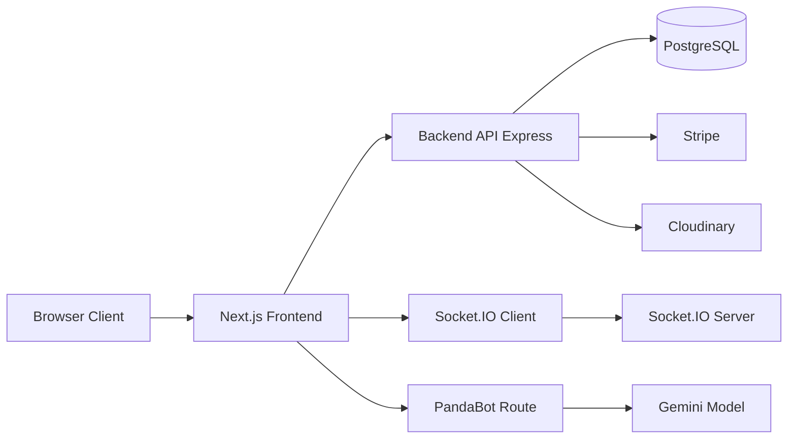
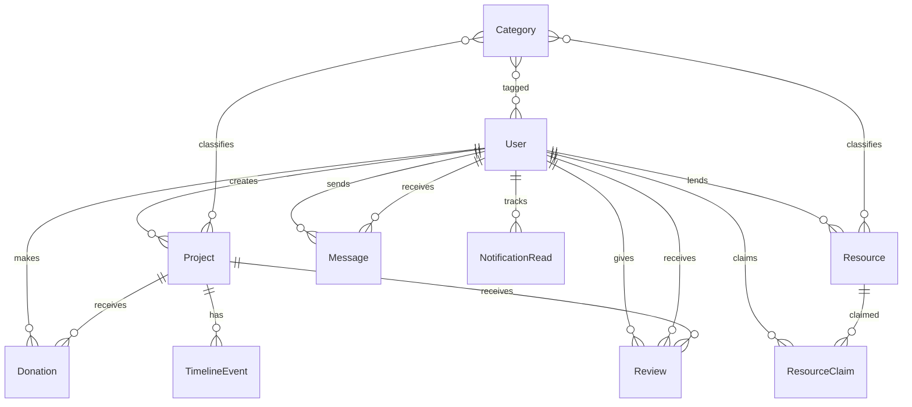
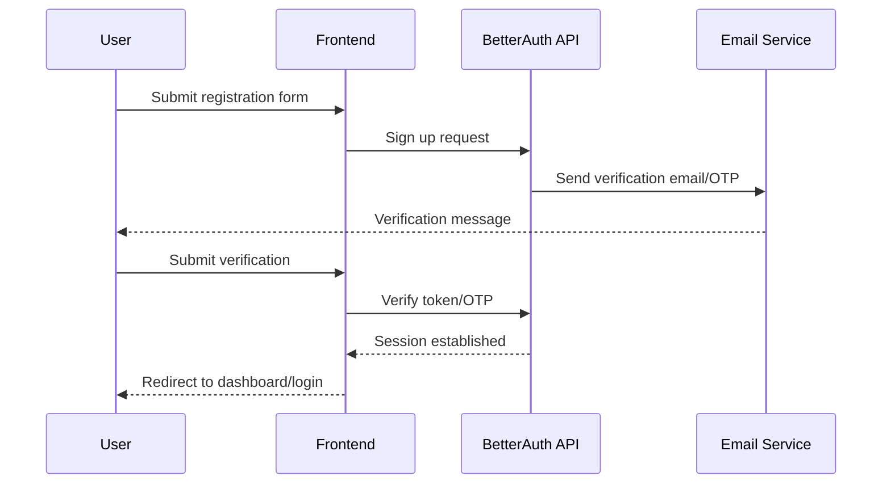
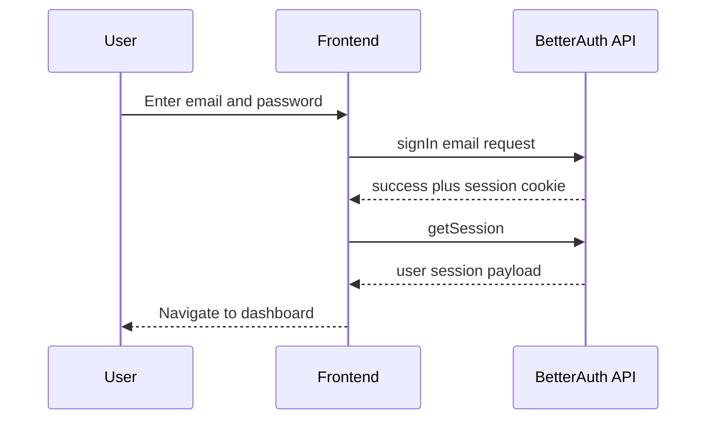
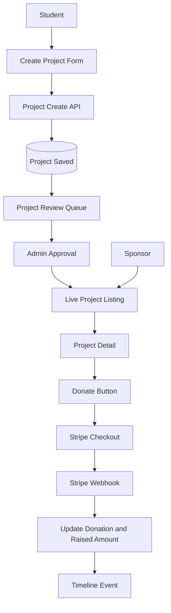
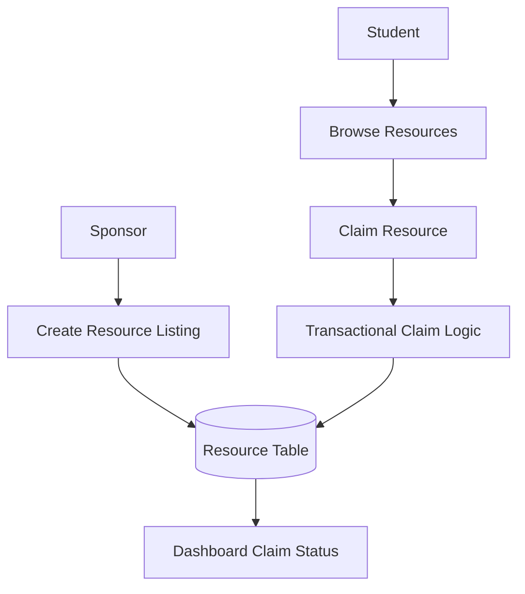

# FundingPanda Master Application Bible

## 1. Document Intent

This document is the complete technical and operational reference for FundingPanda.

It is designed for:
- Company technical reviewers.
- Engineering managers.
- Product managers.
- DevOps teams.
- Security teams.
- New contributors.

This guide explains:
- What the application does.
- How each major feature works.
- How data moves through the system.
- Why architecture decisions were made.
- How optimization, maintainability, and scalability were handled.
- How the project is structured.
- How to operate and extend the application safely.

---

## 2. System Snapshot

- Product Name: FundingPanda
- Product Type: Academic research crowdfunding and collaboration platform
- Frontend Stack: Next.js 16, React 19, TypeScript, Tailwind CSS 4, TanStack Query
- Backend Stack: Express 5, TypeScript, Prisma, PostgreSQL, BetterAuth, Socket.IO
- Payment: Stripe
- Media: Cloudinary
- AI Assistant: PandaBot via Vercel AI SDK and Gemini

Live environments:
- Frontend: https://funding-panda-frontend.vercel.app/
- Backend: https://fundingpanda-backend.onrender.com/

---

## 3. Product Goals and Problem Statement

FundingPanda solves the funding gap between academic innovation and sponsor capital.

Primary goals:
- Enable students to present fundable research ideas.
- Enable sponsors to discover and support high-potential research.
- Track project progress through milestones and timelines.
- Facilitate transparent communication through messaging and notifications.
- Support community trust through profile visibility and reviews.
- Provide an operational panel for administrators.

---

## 4. User Personas

### 4.1 Student
- Creates projects.
- Adds project details and media.
- Submits for review.
- Tracks funding progress.
- Claims resources.
- Chats with sponsors.

### 4.2 Sponsor
- Discovers projects.
- Reviews student profile and project details.
- Donates via Stripe.
- Lists resources for student claims.
- Chats with students.

### 4.3 Admin
- Moderates projects.
- Manages categories.
- Manages users and verification status.
- Oversees donations and platform activity.

### 4.4 Public Visitor
- Browses projects and resources.
- Views rankings and informational pages.
- Enters auth funnel from public pages.

---

## 5. High-Level Architecture

Key architecture decisions:
- Split frontend and backend for independent deployment and scaling.
- Use Prisma for relational integrity.
- Use BetterAuth for auth/session lifecycle.
- Use TanStack Query for frontend server-state correctness.
- Use Socket.IO for low-latency communication.

---

## 6. Frontend Architecture

### 6.1 Route Segmentation
- Public routes under app root.
- Auth routes under app auth route group.
- Protected routes under app dashboard route group.

### 6.2 Layering
- Route layer in src/app.
- Shared UI components in src/components.
- Service data layer in src/services.
- Core clients and helpers in src/lib.
- Global provider wiring in src/providers.

### 6.3 Error and Recovery Design
- not-found page handles unknown routes.
- segment-level error boundary handles local route failures.
- global error boundary handles severe failures.
- toaster feedback surfaces actionable messages.

---

## 7. Backend Architecture

### 7.1 Service Pattern
- Controller receives request.
- Validation middleware validates payload.
- Service executes business logic.
- Shared response helper formats output.
- Global error middleware normalizes errors.

### 7.2 Module Strategy
Backend modules:
- admin
- analytics
- category
- donation
- engagement
- message
- notification
- project
- resource
- review
- timeline
- user

### 7.3 Core Infrastructure
- app.ts defines middleware, CORS, auth handler, and routes.
- server.ts bootstraps HTTP + Socket.IO server.
- prisma schema defines relational model and enums.

---

## 8. Database Model Overview

Core model entities:
- User
- Session
- Account
- Verification
- Category
- Project
- Donation
- TimelineEvent
- Review
- Resource
- ResourceClaim
- Message
- NotificationRead
- BotAnalytics

---

## 9. End-to-End User Flows

### 9.1 Registration and Verification Flow

### 9.2 Login Flow

### 9.3 Project Creation and Funding Flow

### 9.4 Messaging Flow

### 9.5 Resource Claim Flow

---

## 10. Complete Frontend Route Inventory

### 10.1 Public Routes
- /
- /about
- /contact
- /faq
- /leaderboard
- /newsletter
- /privacy
- /projects
- /projects/[id]
- /resources
- /terms
- /users/[id]
- /payment/success
- /payment/cancel

### 10.2 Auth Routes
- /login
- /register
- /forgot-password
- /reset-password
- /verify-email

### 10.3 Dashboard Routes
- /dashboard
- /dashboard/settings
- /dashboard/create-project
- /dashboard/my-projects
- /dashboard/donations
- /dashboard/resources
- /dashboard/my-items
- /dashboard/messages
- /dashboard/notifications
- /dashboard/admin
- /dashboard/admin/categories
- /dashboard/admin/donations
- /dashboard/admin/users

---

## 11. Complete Backend API Surface

### 11.1 API Root Groups
- /api/auth/*
- /api/v1/users/*
- /api/v1/projects/*
- /api/v1/resources/*
- /api/v1/donations/*
- /api/v1/timeline/*
- /api/v1/reviews/*
- /api/v1/messages/*
- /api/v1/notifications/*
- /api/v1/admin/*
- /api/v1/analytics/*
- /api/v1/health

### 11.2 Real-Time Events
- join_own_room
- send_message
- receive_message

---

## 12. Project Structure Reference

### 12.1 Frontend Source Structure
- src/app
- src/components/layout
- src/components/projects
- src/components/ui
- src/components/ui/layout
- src/lib
- src/lib/validations
- src/providers
- src/services
- src/types

### 12.2 Backend Source Structure
- src/config
- src/errors
- src/interfaces
- src/lib
- src/middlewares
- src/modules
- src/routes
- src/shared
- src/socket
- src/utils
- prisma/schema.prisma

---

## 13. Optimization Strategy

### 13.1 Frontend Optimization Patterns
- Query caching and invalidation through TanStack Query.
- Conditional query execution via enabled flags.
- Optimistic UI patterns in messaging.
- Shared API client instance for consistent request behavior.
- Shared error parser to reduce duplicated error handling code.
- Route group layouts to avoid duplicated shell code.

### 13.2 Backend Optimization Patterns
- Transactional writes for money and inventory critical flows.
- Service-level separation for cleaner profiling and scaling.
- Reusable query builder for paginated/filterable lists.
- Centralized middleware chain to reduce repeated logic.

### 13.3 Operational Optimization Patterns
- Independent frontend and backend deployment pipelines.
- Environment-driven config for flexible staging and production.
- Build and lint gates before release.

---

## 14. Maintainability Strategy

Maintainability practices implemented:
- TypeScript used across frontend and backend.
- Domain service files for API boundaries.
- Validation schemas near domain modules.
- Shared response and error handling utilities.
- Reusable UI primitives to reduce duplicated styling logic.
- Route group architecture for clear navigation ownership.

Maintainability outcomes:
- Faster onboarding for new developers.
- Smaller blast radius for refactors.
- Better testability of isolated modules.

---

## 15. Scalability Strategy

Scalability mechanisms already in place:
- Stateless API layer suitable for horizontal scaling.
- Database-backed source of truth for transactional events.
- Socket room model for private message fan-out.
- Service modularization for team parallelism.

Future scalability path:
- Add queue for non-critical asynchronous workloads.
- Add cache for heavy read endpoints.
- Add read replicas for analytics-heavy workloads.
- Add distributed tracing and SLO tracking.

---

## 16. Security and Compliance View

Current controls:
- Helmet security headers.
- CORS allowlist.
- Trusted origins for auth.
- Secure production cookie attributes.
- Role checks on protected routes.
- Validation on incoming payloads.

Known deployment concern:
- Cross-site auth cookies can fail in strict incognito privacy modes when frontend and backend use unrelated domains.

Mitigation:
- Prefer same-site subdomains under a shared top-level domain.

---

## 17. Quality Engineering Strategy

Current quality checks:
- Frontend build.
- Backend build.
- Frontend lint.
- TypeScript compile checks as part of build.

Recommended quality expansion:
- Unit tests for service utilities.
- Integration tests for critical API flows.
- End-to-end tests for auth, donation, and messaging.
- Contract tests for frontend service methods and backend responses.

---

## 18. DevOps and Environment Strategy

### 18.1 Frontend Environments
- Local development via Next dev server.
- Production deployment on Vercel.

### 18.2 Backend Environments
- Local development via Node and tsup output.
- Production deployment on Render.

### 18.3 Critical Environment Variables
- NEXT_PUBLIC_API_URL
- NEXT_PUBLIC_BACKEND_URL
- NEXT_PUBLIC_AUTH_URL
- GOOGLE_GENERATIVE_AI_API_KEY
- PORT
- FRONTEND_URL
- BETTER_AUTH_URL
- DATABASE_URL
- STRIPE_SECRET_KEY
- STRIPE_WEBHOOK_SECRET
- CLOUDINARY variables

---

## 19. Mermaid Flow Catalog

The application includes multiple major flows represented in this document:
- Registration and verification.
- Login and session bootstrap.
- Project creation to funding completion.
- Messaging and live updates.
- Resource listing and claim lifecycle.

---

## 20. Traceability Model

Traceability links the product journey from UX to data:
- Route -> Service Function -> API Endpoint -> Service Layer -> Database Model

This pattern is used throughout FundingPanda and allows engineering teams to trace defects quickly.

---

## 21. Extension Strategy

Safe extension pattern:
1. Add backend model or field in Prisma.
2. Add backend validation and service behavior.
3. Expose endpoint or event.
4. Add frontend service call.
5. Add route UI.
6. Add notifications/analytics where needed.
7. Add docs and quality checks.

---

## 22. Reliability Risks and Mitigations

- Risk: Third-party cookie restrictions in private browsing.
  Mitigation: same-site domain strategy and clear user guidance.
- Risk: High traffic in public listing pages.
  Mitigation: API pagination and caching roadmap.
- Risk: Real-time message ordering edge cases.
  Mitigation: idempotent client merge and server source of truth.
- Risk: Payment reconciliation mismatch.
  Mitigation: webhook verification and transactional updates.

---

## 23. Governance Checklist Summary

- Architecture documented.
- Data model documented.
- APIs documented.
- Route inventory documented.
- Role capabilities documented.
- Security controls documented.
- Optimization and scalability documented.
- Operational notes documented.

---

## 24. Appendices

The remaining sections provide exhaustive, line-by-line, role-by-role, route-by-route, service-by-service operational detail.

## 25. Public Route Deep Dive Matrix

### Route: /
- Purpose: Deliver public-facing product value and discovery.
- Data dependencies: Route-specific read APIs with graceful empty states.
- User actions: Explore, filter, navigate, and convert to authenticated actions.
- Error model: Toasts plus route-level fallback handling where applicable.
- Performance model: Cached reads and paginated collections for list pages.
- Security model: Public-safe data exposure only.
- Maintainability note: Route behavior is isolated to service-layer contracts.

### Route: /about
- Purpose: Deliver public-facing product value and discovery.
- Data dependencies: Route-specific read APIs with graceful empty states.
- User actions: Explore, filter, navigate, and convert to authenticated actions.
- Error model: Toasts plus route-level fallback handling where applicable.
- Performance model: Cached reads and paginated collections for list pages.
- Security model: Public-safe data exposure only.
- Maintainability note: Route behavior is isolated to service-layer contracts.

### Route: /contact
- Purpose: Deliver public-facing product value and discovery.
- Data dependencies: Route-specific read APIs with graceful empty states.
- User actions: Explore, filter, navigate, and convert to authenticated actions.
- Error model: Toasts plus route-level fallback handling where applicable.
- Performance model: Cached reads and paginated collections for list pages.
- Security model: Public-safe data exposure only.
- Maintainability note: Route behavior is isolated to service-layer contracts.

### Route: /faq
- Purpose: Deliver public-facing product value and discovery.
- Data dependencies: Route-specific read APIs with graceful empty states.
- User actions: Explore, filter, navigate, and convert to authenticated actions.
- Error model: Toasts plus route-level fallback handling where applicable.
- Performance model: Cached reads and paginated collections for list pages.
- Security model: Public-safe data exposure only.
- Maintainability note: Route behavior is isolated to service-layer contracts.

### Route: /leaderboard
- Purpose: Deliver public-facing product value and discovery.
- Data dependencies: Route-specific read APIs with graceful empty states.
- User actions: Explore, filter, navigate, and convert to authenticated actions.
- Error model: Toasts plus route-level fallback handling where applicable.
- Performance model: Cached reads and paginated collections for list pages.
- Security model: Public-safe data exposure only.
- Maintainability note: Route behavior is isolated to service-layer contracts.

### Route: /newsletter
- Purpose: Deliver public-facing product value and discovery.
- Data dependencies: Route-specific read APIs with graceful empty states.
- User actions: Explore, filter, navigate, and convert to authenticated actions.
- Error model: Toasts plus route-level fallback handling where applicable.
- Performance model: Cached reads and paginated collections for list pages.
- Security model: Public-safe data exposure only.
- Maintainability note: Route behavior is isolated to service-layer contracts.

### Route: /privacy
- Purpose: Deliver public-facing product value and discovery.
- Data dependencies: Route-specific read APIs with graceful empty states.
- User actions: Explore, filter, navigate, and convert to authenticated actions.
- Error model: Toasts plus route-level fallback handling where applicable.
- Performance model: Cached reads and paginated collections for list pages.
- Security model: Public-safe data exposure only.
- Maintainability note: Route behavior is isolated to service-layer contracts.

### Route: /projects
- Purpose: Deliver public-facing product value and discovery.
- Data dependencies: Route-specific read APIs with graceful empty states.
- User actions: Explore, filter, navigate, and convert to authenticated actions.
- Error model: Toasts plus route-level fallback handling where applicable.
- Performance model: Cached reads and paginated collections for list pages.
- Security model: Public-safe data exposure only.
- Maintainability note: Route behavior is isolated to service-layer contracts.

### Route: /projects/[id]
- Purpose: Deliver public-facing product value and discovery.
- Data dependencies: Route-specific read APIs with graceful empty states.
- User actions: Explore, filter, navigate, and convert to authenticated actions.
- Error model: Toasts plus route-level fallback handling where applicable.
- Performance model: Cached reads and paginated collections for list pages.
- Security model: Public-safe data exposure only.
- Maintainability note: Route behavior is isolated to service-layer contracts.

### Route: /resources
- Purpose: Deliver public-facing product value and discovery.
- Data dependencies: Route-specific read APIs with graceful empty states.
- User actions: Explore, filter, navigate, and convert to authenticated actions.
- Error model: Toasts plus route-level fallback handling where applicable.
- Performance model: Cached reads and paginated collections for list pages.
- Security model: Public-safe data exposure only.
- Maintainability note: Route behavior is isolated to service-layer contracts.

### Route: /terms
- Purpose: Deliver public-facing product value and discovery.
- Data dependencies: Route-specific read APIs with graceful empty states.
- User actions: Explore, filter, navigate, and convert to authenticated actions.
- Error model: Toasts plus route-level fallback handling where applicable.
- Performance model: Cached reads and paginated collections for list pages.
- Security model: Public-safe data exposure only.
- Maintainability note: Route behavior is isolated to service-layer contracts.

### Route: /users/[id]
- Purpose: Deliver public-facing product value and discovery.
- Data dependencies: Route-specific read APIs with graceful empty states.
- User actions: Explore, filter, navigate, and convert to authenticated actions.
- Error model: Toasts plus route-level fallback handling where applicable.
- Performance model: Cached reads and paginated collections for list pages.
- Security model: Public-safe data exposure only.
- Maintainability note: Route behavior is isolated to service-layer contracts.

### Route: /payment/success
- Purpose: Deliver public-facing product value and discovery.
- Data dependencies: Route-specific read APIs with graceful empty states.
- User actions: Explore, filter, navigate, and convert to authenticated actions.
- Error model: Toasts plus route-level fallback handling where applicable.
- Performance model: Cached reads and paginated collections for list pages.
- Security model: Public-safe data exposure only.
- Maintainability note: Route behavior is isolated to service-layer contracts.

### Route: /payment/cancel
- Purpose: Deliver public-facing product value and discovery.
- Data dependencies: Route-specific read APIs with graceful empty states.
- User actions: Explore, filter, navigate, and convert to authenticated actions.
- Error model: Toasts plus route-level fallback handling where applicable.
- Performance model: Cached reads and paginated collections for list pages.
- Security model: Public-safe data exposure only.
- Maintainability note: Route behavior is isolated to service-layer contracts.

## 26. Auth Route Deep Dive Matrix

### Route: /login
- Purpose: Authentication and account lifecycle.
- Data dependencies: BetterAuth endpoints and user status checks.
- Validation model: Client-side schema validation before submission.
- Error model: User-friendly auth messages with remediation guidance.
- Session model: Cookie-backed session establishment and retrieval.
- Security model: Sensitive operations use secure cookie behavior in production.
- Maintainability note: Shared auth client centralizes base URL resolution.

### Route: /register
- Purpose: Authentication and account lifecycle.
- Data dependencies: BetterAuth endpoints and user status checks.
- Validation model: Client-side schema validation before submission.
- Error model: User-friendly auth messages with remediation guidance.
- Session model: Cookie-backed session establishment and retrieval.
- Security model: Sensitive operations use secure cookie behavior in production.
- Maintainability note: Shared auth client centralizes base URL resolution.

### Route: /forgot-password
- Purpose: Authentication and account lifecycle.
- Data dependencies: BetterAuth endpoints and user status checks.
- Validation model: Client-side schema validation before submission.
- Error model: User-friendly auth messages with remediation guidance.
- Session model: Cookie-backed session establishment and retrieval.
- Security model: Sensitive operations use secure cookie behavior in production.
- Maintainability note: Shared auth client centralizes base URL resolution.

### Route: /reset-password
- Purpose: Authentication and account lifecycle.
- Data dependencies: BetterAuth endpoints and user status checks.
- Validation model: Client-side schema validation before submission.
- Error model: User-friendly auth messages with remediation guidance.
- Session model: Cookie-backed session establishment and retrieval.
- Security model: Sensitive operations use secure cookie behavior in production.
- Maintainability note: Shared auth client centralizes base URL resolution.

### Route: /verify-email
- Purpose: Authentication and account lifecycle.
- Data dependencies: BetterAuth endpoints and user status checks.
- Validation model: Client-side schema validation before submission.
- Error model: User-friendly auth messages with remediation guidance.
- Session model: Cookie-backed session establishment and retrieval.
- Security model: Sensitive operations use secure cookie behavior in production.
- Maintainability note: Shared auth client centralizes base URL resolution.

## 27. Dashboard Route Deep Dive Matrix

### Route: /dashboard
- Purpose: Role-aware operational workspace.
- Data dependencies: Session-gated query keys and domain APIs.
- Query strategy: TanStack Query with enabled guards and invalidation.
- UX strategy: Responsive cards, tables, and state transitions.
- Authorization model: Frontend role gating plus backend hard checks.
- Error model: Toast feedback and defensive empty-state rendering.
- Maintainability note: Service methods isolate endpoint details from UI code.

### Route: /dashboard/settings
- Purpose: Role-aware operational workspace.
- Data dependencies: Session-gated query keys and domain APIs.
- Query strategy: TanStack Query with enabled guards and invalidation.
- UX strategy: Responsive cards, tables, and state transitions.
- Authorization model: Frontend role gating plus backend hard checks.
- Error model: Toast feedback and defensive empty-state rendering.
- Maintainability note: Service methods isolate endpoint details from UI code.

### Route: /dashboard/create-project
- Purpose: Role-aware operational workspace.
- Data dependencies: Session-gated query keys and domain APIs.
- Query strategy: TanStack Query with enabled guards and invalidation.
- UX strategy: Responsive cards, tables, and state transitions.
- Authorization model: Frontend role gating plus backend hard checks.
- Error model: Toast feedback and defensive empty-state rendering.
- Maintainability note: Service methods isolate endpoint details from UI code.

### Route: /dashboard/my-projects
- Purpose: Role-aware operational workspace.
- Data dependencies: Session-gated query keys and domain APIs.
- Query strategy: TanStack Query with enabled guards and invalidation.
- UX strategy: Responsive cards, tables, and state transitions.
- Authorization model: Frontend role gating plus backend hard checks.
- Error model: Toast feedback and defensive empty-state rendering.
- Maintainability note: Service methods isolate endpoint details from UI code.

### Route: /dashboard/donations
- Purpose: Role-aware operational workspace.
- Data dependencies: Session-gated query keys and domain APIs.
- Query strategy: TanStack Query with enabled guards and invalidation.
- UX strategy: Responsive cards, tables, and state transitions.
- Authorization model: Frontend role gating plus backend hard checks.
- Error model: Toast feedback and defensive empty-state rendering.
- Maintainability note: Service methods isolate endpoint details from UI code.

### Route: /dashboard/resources
- Purpose: Role-aware operational workspace.
- Data dependencies: Session-gated query keys and domain APIs.
- Query strategy: TanStack Query with enabled guards and invalidation.
- UX strategy: Responsive cards, tables, and state transitions.
- Authorization model: Frontend role gating plus backend hard checks.
- Error model: Toast feedback and defensive empty-state rendering.
- Maintainability note: Service methods isolate endpoint details from UI code.

### Route: /dashboard/my-items
- Purpose: Role-aware operational workspace.
- Data dependencies: Session-gated query keys and domain APIs.
- Query strategy: TanStack Query with enabled guards and invalidation.
- UX strategy: Responsive cards, tables, and state transitions.
- Authorization model: Frontend role gating plus backend hard checks.
- Error model: Toast feedback and defensive empty-state rendering.
- Maintainability note: Service methods isolate endpoint details from UI code.

### Route: /dashboard/messages
- Purpose: Role-aware operational workspace.
- Data dependencies: Session-gated query keys and domain APIs.
- Query strategy: TanStack Query with enabled guards and invalidation.
- UX strategy: Responsive cards, tables, and state transitions.
- Authorization model: Frontend role gating plus backend hard checks.
- Error model: Toast feedback and defensive empty-state rendering.
- Maintainability note: Service methods isolate endpoint details from UI code.

### Route: /dashboard/notifications
- Purpose: Role-aware operational workspace.
- Data dependencies: Session-gated query keys and domain APIs.
- Query strategy: TanStack Query with enabled guards and invalidation.
- UX strategy: Responsive cards, tables, and state transitions.
- Authorization model: Frontend role gating plus backend hard checks.
- Error model: Toast feedback and defensive empty-state rendering.
- Maintainability note: Service methods isolate endpoint details from UI code.

### Route: /dashboard/admin
- Purpose: Role-aware operational workspace.
- Data dependencies: Session-gated query keys and domain APIs.
- Query strategy: TanStack Query with enabled guards and invalidation.
- UX strategy: Responsive cards, tables, and state transitions.
- Authorization model: Frontend role gating plus backend hard checks.
- Error model: Toast feedback and defensive empty-state rendering.
- Maintainability note: Service methods isolate endpoint details from UI code.

### Route: /dashboard/admin/categories
- Purpose: Role-aware operational workspace.
- Data dependencies: Session-gated query keys and domain APIs.
- Query strategy: TanStack Query with enabled guards and invalidation.
- UX strategy: Responsive cards, tables, and state transitions.
- Authorization model: Frontend role gating plus backend hard checks.
- Error model: Toast feedback and defensive empty-state rendering.
- Maintainability note: Service methods isolate endpoint details from UI code.

### Route: /dashboard/admin/donations
- Purpose: Role-aware operational workspace.
- Data dependencies: Session-gated query keys and domain APIs.
- Query strategy: TanStack Query with enabled guards and invalidation.
- UX strategy: Responsive cards, tables, and state transitions.
- Authorization model: Frontend role gating plus backend hard checks.
- Error model: Toast feedback and defensive empty-state rendering.
- Maintainability note: Service methods isolate endpoint details from UI code.

### Route: /dashboard/admin/users
- Purpose: Role-aware operational workspace.
- Data dependencies: Session-gated query keys and domain APIs.
- Query strategy: TanStack Query with enabled guards and invalidation.
- UX strategy: Responsive cards, tables, and state transitions.
- Authorization model: Frontend role gating plus backend hard checks.
- Error model: Toast feedback and defensive empty-state rendering.
- Maintainability note: Service methods isolate endpoint details from UI code.

## 28. Frontend Service Contract Matrix

### Service: admin.service.ts
- Responsibility: Encapsulate domain API calls and request options.
- Request client: Shared axios instance with credentials enabled.
- Success path: Returns typed payloads for route components.
- Failure path: Throws errors consumed by shared error parser.
- Caching relation: Query keys owned by route-level useQuery hooks.
- Scalability relation: Service boundaries enable independent refactor.
- Testability relation: Pure request methods support isolated mocking.
- Maintainability relation: Domain naming keeps ownership explicit.

### Service: donation.service.ts
- Responsibility: Encapsulate domain API calls and request options.
- Request client: Shared axios instance with credentials enabled.
- Success path: Returns typed payloads for route components.
- Failure path: Throws errors consumed by shared error parser.
- Caching relation: Query keys owned by route-level useQuery hooks.
- Scalability relation: Service boundaries enable independent refactor.
- Testability relation: Pure request methods support isolated mocking.
- Maintainability relation: Domain naming keeps ownership explicit.

### Service: marketing.service.ts
- Responsibility: Encapsulate domain API calls and request options.
- Request client: Shared axios instance with credentials enabled.
- Success path: Returns typed payloads for route components.
- Failure path: Throws errors consumed by shared error parser.
- Caching relation: Query keys owned by route-level useQuery hooks.
- Scalability relation: Service boundaries enable independent refactor.
- Testability relation: Pure request methods support isolated mocking.
- Maintainability relation: Domain naming keeps ownership explicit.

### Service: message.service.ts
- Responsibility: Encapsulate domain API calls and request options.
- Request client: Shared axios instance with credentials enabled.
- Success path: Returns typed payloads for route components.
- Failure path: Throws errors consumed by shared error parser.
- Caching relation: Query keys owned by route-level useQuery hooks.
- Scalability relation: Service boundaries enable independent refactor.
- Testability relation: Pure request methods support isolated mocking.
- Maintainability relation: Domain naming keeps ownership explicit.

### Service: notification.service.ts
- Responsibility: Encapsulate domain API calls and request options.
- Request client: Shared axios instance with credentials enabled.
- Success path: Returns typed payloads for route components.
- Failure path: Throws errors consumed by shared error parser.
- Caching relation: Query keys owned by route-level useQuery hooks.
- Scalability relation: Service boundaries enable independent refactor.
- Testability relation: Pure request methods support isolated mocking.
- Maintainability relation: Domain naming keeps ownership explicit.

### Service: payment.service.ts
- Responsibility: Encapsulate domain API calls and request options.
- Request client: Shared axios instance with credentials enabled.
- Success path: Returns typed payloads for route components.
- Failure path: Throws errors consumed by shared error parser.
- Caching relation: Query keys owned by route-level useQuery hooks.
- Scalability relation: Service boundaries enable independent refactor.
- Testability relation: Pure request methods support isolated mocking.
- Maintainability relation: Domain naming keeps ownership explicit.

### Service: project.service.ts
- Responsibility: Encapsulate domain API calls and request options.
- Request client: Shared axios instance with credentials enabled.
- Success path: Returns typed payloads for route components.
- Failure path: Throws errors consumed by shared error parser.
- Caching relation: Query keys owned by route-level useQuery hooks.
- Scalability relation: Service boundaries enable independent refactor.
- Testability relation: Pure request methods support isolated mocking.
- Maintainability relation: Domain naming keeps ownership explicit.

### Service: resource.service.ts
- Responsibility: Encapsulate domain API calls and request options.
- Request client: Shared axios instance with credentials enabled.
- Success path: Returns typed payloads for route components.
- Failure path: Throws errors consumed by shared error parser.
- Caching relation: Query keys owned by route-level useQuery hooks.
- Scalability relation: Service boundaries enable independent refactor.
- Testability relation: Pure request methods support isolated mocking.
- Maintainability relation: Domain naming keeps ownership explicit.

### Service: review.service.ts
- Responsibility: Encapsulate domain API calls and request options.
- Request client: Shared axios instance with credentials enabled.
- Success path: Returns typed payloads for route components.
- Failure path: Throws errors consumed by shared error parser.
- Caching relation: Query keys owned by route-level useQuery hooks.
- Scalability relation: Service boundaries enable independent refactor.
- Testability relation: Pure request methods support isolated mocking.
- Maintainability relation: Domain naming keeps ownership explicit.

### Service: timeline.service.ts
- Responsibility: Encapsulate domain API calls and request options.
- Request client: Shared axios instance with credentials enabled.
- Success path: Returns typed payloads for route components.
- Failure path: Throws errors consumed by shared error parser.
- Caching relation: Query keys owned by route-level useQuery hooks.
- Scalability relation: Service boundaries enable independent refactor.
- Testability relation: Pure request methods support isolated mocking.
- Maintainability relation: Domain naming keeps ownership explicit.

### Service: user.service.ts
- Responsibility: Encapsulate domain API calls and request options.
- Request client: Shared axios instance with credentials enabled.
- Success path: Returns typed payloads for route components.
- Failure path: Throws errors consumed by shared error parser.
- Caching relation: Query keys owned by route-level useQuery hooks.
- Scalability relation: Service boundaries enable independent refactor.
- Testability relation: Pure request methods support isolated mocking.
- Maintainability relation: Domain naming keeps ownership explicit.

## 29. Backend Module Contract Matrix

### Module: admin
- Files: controller, route, service, interface, validation as needed.
- Controller role: Accept request and delegate to service.
- Service role: Business logic and persistence orchestration.
- Validation role: Input contract boundary at API edge.
- Route role: Endpoint to controller mapping.
- Error role: AppError and global middleware integration.
- Scalability role: Vertical module isolation and team ownership.
- Maintainability role: Predictable file naming and dependency direction.

### Module: analytics
- Files: controller, route, service, interface, validation as needed.
- Controller role: Accept request and delegate to service.
- Service role: Business logic and persistence orchestration.
- Validation role: Input contract boundary at API edge.
- Route role: Endpoint to controller mapping.
- Error role: AppError and global middleware integration.
- Scalability role: Vertical module isolation and team ownership.
- Maintainability role: Predictable file naming and dependency direction.

### Module: category
- Files: controller, route, service, interface, validation as needed.
- Controller role: Accept request and delegate to service.
- Service role: Business logic and persistence orchestration.
- Validation role: Input contract boundary at API edge.
- Route role: Endpoint to controller mapping.
- Error role: AppError and global middleware integration.
- Scalability role: Vertical module isolation and team ownership.
- Maintainability role: Predictable file naming and dependency direction.

### Module: donation
- Files: controller, route, service, interface, validation as needed.
- Controller role: Accept request and delegate to service.
- Service role: Business logic and persistence orchestration.
- Validation role: Input contract boundary at API edge.
- Route role: Endpoint to controller mapping.
- Error role: AppError and global middleware integration.
- Scalability role: Vertical module isolation and team ownership.
- Maintainability role: Predictable file naming and dependency direction.

### Module: engagement
- Files: controller, route, service, interface, validation as needed.
- Controller role: Accept request and delegate to service.
- Service role: Business logic and persistence orchestration.
- Validation role: Input contract boundary at API edge.
- Route role: Endpoint to controller mapping.
- Error role: AppError and global middleware integration.
- Scalability role: Vertical module isolation and team ownership.
- Maintainability role: Predictable file naming and dependency direction.

### Module: message
- Files: controller, route, service, interface, validation as needed.
- Controller role: Accept request and delegate to service.
- Service role: Business logic and persistence orchestration.
- Validation role: Input contract boundary at API edge.
- Route role: Endpoint to controller mapping.
- Error role: AppError and global middleware integration.
- Scalability role: Vertical module isolation and team ownership.
- Maintainability role: Predictable file naming and dependency direction.

### Module: notification
- Files: controller, route, service, interface, validation as needed.
- Controller role: Accept request and delegate to service.
- Service role: Business logic and persistence orchestration.
- Validation role: Input contract boundary at API edge.
- Route role: Endpoint to controller mapping.
- Error role: AppError and global middleware integration.
- Scalability role: Vertical module isolation and team ownership.
- Maintainability role: Predictable file naming and dependency direction.

### Module: project
- Files: controller, route, service, interface, validation as needed.
- Controller role: Accept request and delegate to service.
- Service role: Business logic and persistence orchestration.
- Validation role: Input contract boundary at API edge.
- Route role: Endpoint to controller mapping.
- Error role: AppError and global middleware integration.
- Scalability role: Vertical module isolation and team ownership.
- Maintainability role: Predictable file naming and dependency direction.

### Module: resource
- Files: controller, route, service, interface, validation as needed.
- Controller role: Accept request and delegate to service.
- Service role: Business logic and persistence orchestration.
- Validation role: Input contract boundary at API edge.
- Route role: Endpoint to controller mapping.
- Error role: AppError and global middleware integration.
- Scalability role: Vertical module isolation and team ownership.
- Maintainability role: Predictable file naming and dependency direction.

### Module: review
- Files: controller, route, service, interface, validation as needed.
- Controller role: Accept request and delegate to service.
- Service role: Business logic and persistence orchestration.
- Validation role: Input contract boundary at API edge.
- Route role: Endpoint to controller mapping.
- Error role: AppError and global middleware integration.
- Scalability role: Vertical module isolation and team ownership.
- Maintainability role: Predictable file naming and dependency direction.

### Module: timeline
- Files: controller, route, service, interface, validation as needed.
- Controller role: Accept request and delegate to service.
- Service role: Business logic and persistence orchestration.
- Validation role: Input contract boundary at API edge.
- Route role: Endpoint to controller mapping.
- Error role: AppError and global middleware integration.
- Scalability role: Vertical module isolation and team ownership.
- Maintainability role: Predictable file naming and dependency direction.

### Module: user
- Files: controller, route, service, interface, validation as needed.
- Controller role: Accept request and delegate to service.
- Service role: Business logic and persistence orchestration.
- Validation role: Input contract boundary at API edge.
- Route role: Endpoint to controller mapping.
- Error role: AppError and global middleware integration.
- Scalability role: Vertical module isolation and team ownership.
- Maintainability role: Predictable file naming and dependency direction.

## 30. End-to-End Traceability Catalog

- Trace Item 1: Route action maps to service call, API endpoint, backend service, and persisted model with observable user feedback.
- Trace Item 2: Route action maps to service call, API endpoint, backend service, and persisted model with observable user feedback.
- Trace Item 3: Route action maps to service call, API endpoint, backend service, and persisted model with observable user feedback.
- Trace Item 4: Route action maps to service call, API endpoint, backend service, and persisted model with observable user feedback.
- Trace Item 5: Route action maps to service call, API endpoint, backend service, and persisted model with observable user feedback.
- Trace Item 6: Route action maps to service call, API endpoint, backend service, and persisted model with observable user feedback.
- Trace Item 7: Route action maps to service call, API endpoint, backend service, and persisted model with observable user feedback.
- Trace Item 8: Route action maps to service call, API endpoint, backend service, and persisted model with observable user feedback.
- Trace Item 9: Route action maps to service call, API endpoint, backend service, and persisted model with observable user feedback.
- Trace Item 10: Route action maps to service call, API endpoint, backend service, and persisted model with observable user feedback.
- Trace Item 11: Route action maps to service call, API endpoint, backend service, and persisted model with observable user feedback.
- Trace Item 12: Route action maps to service call, API endpoint, backend service, and persisted model with observable user feedback.
- Trace Item 13: Route action maps to service call, API endpoint, backend service, and persisted model with observable user feedback.
- Trace Item 14: Route action maps to service call, API endpoint, backend service, and persisted model with observable user feedback.
- Trace Item 15: Route action maps to service call, API endpoint, backend service, and persisted model with observable user feedback.
- Trace Item 16: Route action maps to service call, API endpoint, backend service, and persisted model with observable user feedback.
- Trace Item 17: Route action maps to service call, API endpoint, backend service, and persisted model with observable user feedback.
- Trace Item 18: Route action maps to service call, API endpoint, backend service, and persisted model with observable user feedback.
- Trace Item 19: Route action maps to service call, API endpoint, backend service, and persisted model with observable user feedback.
- Trace Item 20: Route action maps to service call, API endpoint, backend service, and persisted model with observable user feedback.
- Trace Item 21: Route action maps to service call, API endpoint, backend service, and persisted model with observable user feedback.
- Trace Item 22: Route action maps to service call, API endpoint, backend service, and persisted model with observable user feedback.
- Trace Item 23: Route action maps to service call, API endpoint, backend service, and persisted model with observable user feedback.
- Trace Item 24: Route action maps to service call, API endpoint, backend service, and persisted model with observable user feedback.
- Trace Item 25: Route action maps to service call, API endpoint, backend service, and persisted model with observable user feedback.
- Trace Item 26: Route action maps to service call, API endpoint, backend service, and persisted model with observable user feedback.
- Trace Item 27: Route action maps to service call, API endpoint, backend service, and persisted model with observable user feedback.
- Trace Item 28: Route action maps to service call, API endpoint, backend service, and persisted model with observable user feedback.
- Trace Item 29: Route action maps to service call, API endpoint, backend service, and persisted model with observable user feedback.
- Trace Item 30: Route action maps to service call, API endpoint, backend service, and persisted model with observable user feedback.
- Trace Item 31: Route action maps to service call, API endpoint, backend service, and persisted model with observable user feedback.
- Trace Item 32: Route action maps to service call, API endpoint, backend service, and persisted model with observable user feedback.
- Trace Item 33: Route action maps to service call, API endpoint, backend service, and persisted model with observable user feedback.
- Trace Item 34: Route action maps to service call, API endpoint, backend service, and persisted model with observable user feedback.
- Trace Item 35: Route action maps to service call, API endpoint, backend service, and persisted model with observable user feedback.
- Trace Item 36: Route action maps to service call, API endpoint, backend service, and persisted model with observable user feedback.
- Trace Item 37: Route action maps to service call, API endpoint, backend service, and persisted model with observable user feedback.
- Trace Item 38: Route action maps to service call, API endpoint, backend service, and persisted model with observable user feedback.
- Trace Item 39: Route action maps to service call, API endpoint, backend service, and persisted model with observable user feedback.
- Trace Item 40: Route action maps to service call, API endpoint, backend service, and persisted model with observable user feedback.
- Trace Item 41: Route action maps to service call, API endpoint, backend service, and persisted model with observable user feedback.
- Trace Item 42: Route action maps to service call, API endpoint, backend service, and persisted model with observable user feedback.
- Trace Item 43: Route action maps to service call, API endpoint, backend service, and persisted model with observable user feedback.
- Trace Item 44: Route action maps to service call, API endpoint, backend service, and persisted model with observable user feedback.
- Trace Item 45: Route action maps to service call, API endpoint, backend service, and persisted model with observable user feedback.
- Trace Item 46: Route action maps to service call, API endpoint, backend service, and persisted model with observable user feedback.
- Trace Item 47: Route action maps to service call, API endpoint, backend service, and persisted model with observable user feedback.
- Trace Item 48: Route action maps to service call, API endpoint, backend service, and persisted model with observable user feedback.
- Trace Item 49: Route action maps to service call, API endpoint, backend service, and persisted model with observable user feedback.
- Trace Item 50: Route action maps to service call, API endpoint, backend service, and persisted model with observable user feedback.
- Trace Item 51: Route action maps to service call, API endpoint, backend service, and persisted model with observable user feedback.
- Trace Item 52: Route action maps to service call, API endpoint, backend service, and persisted model with observable user feedback.
- Trace Item 53: Route action maps to service call, API endpoint, backend service, and persisted model with observable user feedback.
- Trace Item 54: Route action maps to service call, API endpoint, backend service, and persisted model with observable user feedback.
- Trace Item 55: Route action maps to service call, API endpoint, backend service, and persisted model with observable user feedback.
- Trace Item 56: Route action maps to service call, API endpoint, backend service, and persisted model with observable user feedback.
- Trace Item 57: Route action maps to service call, API endpoint, backend service, and persisted model with observable user feedback.
- Trace Item 58: Route action maps to service call, API endpoint, backend service, and persisted model with observable user feedback.
- Trace Item 59: Route action maps to service call, API endpoint, backend service, and persisted model with observable user feedback.
- Trace Item 60: Route action maps to service call, API endpoint, backend service, and persisted model with observable user feedback.
- Trace Item 61: Route action maps to service call, API endpoint, backend service, and persisted model with observable user feedback.
- Trace Item 62: Route action maps to service call, API endpoint, backend service, and persisted model with observable user feedback.
- Trace Item 63: Route action maps to service call, API endpoint, backend service, and persisted model with observable user feedback.
- Trace Item 64: Route action maps to service call, API endpoint, backend service, and persisted model with observable user feedback.
- Trace Item 65: Route action maps to service call, API endpoint, backend service, and persisted model with observable user feedback.
- Trace Item 66: Route action maps to service call, API endpoint, backend service, and persisted model with observable user feedback.
- Trace Item 67: Route action maps to service call, API endpoint, backend service, and persisted model with observable user feedback.
- Trace Item 68: Route action maps to service call, API endpoint, backend service, and persisted model with observable user feedback.
- Trace Item 69: Route action maps to service call, API endpoint, backend service, and persisted model with observable user feedback.
- Trace Item 70: Route action maps to service call, API endpoint, backend service, and persisted model with observable user feedback.
- Trace Item 71: Route action maps to service call, API endpoint, backend service, and persisted model with observable user feedback.
- Trace Item 72: Route action maps to service call, API endpoint, backend service, and persisted model with observable user feedback.
- Trace Item 73: Route action maps to service call, API endpoint, backend service, and persisted model with observable user feedback.
- Trace Item 74: Route action maps to service call, API endpoint, backend service, and persisted model with observable user feedback.
- Trace Item 75: Route action maps to service call, API endpoint, backend service, and persisted model with observable user feedback.
- Trace Item 76: Route action maps to service call, API endpoint, backend service, and persisted model with observable user feedback.
- Trace Item 77: Route action maps to service call, API endpoint, backend service, and persisted model with observable user feedback.
- Trace Item 78: Route action maps to service call, API endpoint, backend service, and persisted model with observable user feedback.
- Trace Item 79: Route action maps to service call, API endpoint, backend service, and persisted model with observable user feedback.
- Trace Item 80: Route action maps to service call, API endpoint, backend service, and persisted model with observable user feedback.
- Trace Item 81: Route action maps to service call, API endpoint, backend service, and persisted model with observable user feedback.
- Trace Item 82: Route action maps to service call, API endpoint, backend service, and persisted model with observable user feedback.
- Trace Item 83: Route action maps to service call, API endpoint, backend service, and persisted model with observable user feedback.
- Trace Item 84: Route action maps to service call, API endpoint, backend service, and persisted model with observable user feedback.
- Trace Item 85: Route action maps to service call, API endpoint, backend service, and persisted model with observable user feedback.
- Trace Item 86: Route action maps to service call, API endpoint, backend service, and persisted model with observable user feedback.
- Trace Item 87: Route action maps to service call, API endpoint, backend service, and persisted model with observable user feedback.
- Trace Item 88: Route action maps to service call, API endpoint, backend service, and persisted model with observable user feedback.
- Trace Item 89: Route action maps to service call, API endpoint, backend service, and persisted model with observable user feedback.
- Trace Item 90: Route action maps to service call, API endpoint, backend service, and persisted model with observable user feedback.
- Trace Item 91: Route action maps to service call, API endpoint, backend service, and persisted model with observable user feedback.
- Trace Item 92: Route action maps to service call, API endpoint, backend service, and persisted model with observable user feedback.
- Trace Item 93: Route action maps to service call, API endpoint, backend service, and persisted model with observable user feedback.
- Trace Item 94: Route action maps to service call, API endpoint, backend service, and persisted model with observable user feedback.
- Trace Item 95: Route action maps to service call, API endpoint, backend service, and persisted model with observable user feedback.
- Trace Item 96: Route action maps to service call, API endpoint, backend service, and persisted model with observable user feedback.
- Trace Item 97: Route action maps to service call, API endpoint, backend service, and persisted model with observable user feedback.
- Trace Item 98: Route action maps to service call, API endpoint, backend service, and persisted model with observable user feedback.
- Trace Item 99: Route action maps to service call, API endpoint, backend service, and persisted model with observable user feedback.
- Trace Item 100: Route action maps to service call, API endpoint, backend service, and persisted model with observable user feedback.
- Trace Item 101: Route action maps to service call, API endpoint, backend service, and persisted model with observable user feedback.
- Trace Item 102: Route action maps to service call, API endpoint, backend service, and persisted model with observable user feedback.
- Trace Item 103: Route action maps to service call, API endpoint, backend service, and persisted model with observable user feedback.
- Trace Item 104: Route action maps to service call, API endpoint, backend service, and persisted model with observable user feedback.
- Trace Item 105: Route action maps to service call, API endpoint, backend service, and persisted model with observable user feedback.
- Trace Item 106: Route action maps to service call, API endpoint, backend service, and persisted model with observable user feedback.
- Trace Item 107: Route action maps to service call, API endpoint, backend service, and persisted model with observable user feedback.
- Trace Item 108: Route action maps to service call, API endpoint, backend service, and persisted model with observable user feedback.
- Trace Item 109: Route action maps to service call, API endpoint, backend service, and persisted model with observable user feedback.
- Trace Item 110: Route action maps to service call, API endpoint, backend service, and persisted model with observable user feedback.
- Trace Item 111: Route action maps to service call, API endpoint, backend service, and persisted model with observable user feedback.
- Trace Item 112: Route action maps to service call, API endpoint, backend service, and persisted model with observable user feedback.
- Trace Item 113: Route action maps to service call, API endpoint, backend service, and persisted model with observable user feedback.
- Trace Item 114: Route action maps to service call, API endpoint, backend service, and persisted model with observable user feedback.
- Trace Item 115: Route action maps to service call, API endpoint, backend service, and persisted model with observable user feedback.
- Trace Item 116: Route action maps to service call, API endpoint, backend service, and persisted model with observable user feedback.
- Trace Item 117: Route action maps to service call, API endpoint, backend service, and persisted model with observable user feedback.
- Trace Item 118: Route action maps to service call, API endpoint, backend service, and persisted model with observable user feedback.
- Trace Item 119: Route action maps to service call, API endpoint, backend service, and persisted model with observable user feedback.
- Trace Item 120: Route action maps to service call, API endpoint, backend service, and persisted model with observable user feedback.
- Trace Item 121: Route action maps to service call, API endpoint, backend service, and persisted model with observable user feedback.
- Trace Item 122: Route action maps to service call, API endpoint, backend service, and persisted model with observable user feedback.
- Trace Item 123: Route action maps to service call, API endpoint, backend service, and persisted model with observable user feedback.
- Trace Item 124: Route action maps to service call, API endpoint, backend service, and persisted model with observable user feedback.
- Trace Item 125: Route action maps to service call, API endpoint, backend service, and persisted model with observable user feedback.
- Trace Item 126: Route action maps to service call, API endpoint, backend service, and persisted model with observable user feedback.
- Trace Item 127: Route action maps to service call, API endpoint, backend service, and persisted model with observable user feedback.
- Trace Item 128: Route action maps to service call, API endpoint, backend service, and persisted model with observable user feedback.
- Trace Item 129: Route action maps to service call, API endpoint, backend service, and persisted model with observable user feedback.
- Trace Item 130: Route action maps to service call, API endpoint, backend service, and persisted model with observable user feedback.
- Trace Item 131: Route action maps to service call, API endpoint, backend service, and persisted model with observable user feedback.
- Trace Item 132: Route action maps to service call, API endpoint, backend service, and persisted model with observable user feedback.
- Trace Item 133: Route action maps to service call, API endpoint, backend service, and persisted model with observable user feedback.
- Trace Item 134: Route action maps to service call, API endpoint, backend service, and persisted model with observable user feedback.
- Trace Item 135: Route action maps to service call, API endpoint, backend service, and persisted model with observable user feedback.
- Trace Item 136: Route action maps to service call, API endpoint, backend service, and persisted model with observable user feedback.
- Trace Item 137: Route action maps to service call, API endpoint, backend service, and persisted model with observable user feedback.
- Trace Item 138: Route action maps to service call, API endpoint, backend service, and persisted model with observable user feedback.
- Trace Item 139: Route action maps to service call, API endpoint, backend service, and persisted model with observable user feedback.
- Trace Item 140: Route action maps to service call, API endpoint, backend service, and persisted model with observable user feedback.
- Trace Item 141: Route action maps to service call, API endpoint, backend service, and persisted model with observable user feedback.
- Trace Item 142: Route action maps to service call, API endpoint, backend service, and persisted model with observable user feedback.
- Trace Item 143: Route action maps to service call, API endpoint, backend service, and persisted model with observable user feedback.
- Trace Item 144: Route action maps to service call, API endpoint, backend service, and persisted model with observable user feedback.
- Trace Item 145: Route action maps to service call, API endpoint, backend service, and persisted model with observable user feedback.
- Trace Item 146: Route action maps to service call, API endpoint, backend service, and persisted model with observable user feedback.
- Trace Item 147: Route action maps to service call, API endpoint, backend service, and persisted model with observable user feedback.
- Trace Item 148: Route action maps to service call, API endpoint, backend service, and persisted model with observable user feedback.
- Trace Item 149: Route action maps to service call, API endpoint, backend service, and persisted model with observable user feedback.
- Trace Item 150: Route action maps to service call, API endpoint, backend service, and persisted model with observable user feedback.
- Trace Item 151: Route action maps to service call, API endpoint, backend service, and persisted model with observable user feedback.
- Trace Item 152: Route action maps to service call, API endpoint, backend service, and persisted model with observable user feedback.
- Trace Item 153: Route action maps to service call, API endpoint, backend service, and persisted model with observable user feedback.
- Trace Item 154: Route action maps to service call, API endpoint, backend service, and persisted model with observable user feedback.
- Trace Item 155: Route action maps to service call, API endpoint, backend service, and persisted model with observable user feedback.
- Trace Item 156: Route action maps to service call, API endpoint, backend service, and persisted model with observable user feedback.
- Trace Item 157: Route action maps to service call, API endpoint, backend service, and persisted model with observable user feedback.
- Trace Item 158: Route action maps to service call, API endpoint, backend service, and persisted model with observable user feedback.
- Trace Item 159: Route action maps to service call, API endpoint, backend service, and persisted model with observable user feedback.
- Trace Item 160: Route action maps to service call, API endpoint, backend service, and persisted model with observable user feedback.
- Trace Item 161: Route action maps to service call, API endpoint, backend service, and persisted model with observable user feedback.
- Trace Item 162: Route action maps to service call, API endpoint, backend service, and persisted model with observable user feedback.
- Trace Item 163: Route action maps to service call, API endpoint, backend service, and persisted model with observable user feedback.
- Trace Item 164: Route action maps to service call, API endpoint, backend service, and persisted model with observable user feedback.
- Trace Item 165: Route action maps to service call, API endpoint, backend service, and persisted model with observable user feedback.
- Trace Item 166: Route action maps to service call, API endpoint, backend service, and persisted model with observable user feedback.
- Trace Item 167: Route action maps to service call, API endpoint, backend service, and persisted model with observable user feedback.
- Trace Item 168: Route action maps to service call, API endpoint, backend service, and persisted model with observable user feedback.
- Trace Item 169: Route action maps to service call, API endpoint, backend service, and persisted model with observable user feedback.
- Trace Item 170: Route action maps to service call, API endpoint, backend service, and persisted model with observable user feedback.
- Trace Item 171: Route action maps to service call, API endpoint, backend service, and persisted model with observable user feedback.
- Trace Item 172: Route action maps to service call, API endpoint, backend service, and persisted model with observable user feedback.
- Trace Item 173: Route action maps to service call, API endpoint, backend service, and persisted model with observable user feedback.
- Trace Item 174: Route action maps to service call, API endpoint, backend service, and persisted model with observable user feedback.
- Trace Item 175: Route action maps to service call, API endpoint, backend service, and persisted model with observable user feedback.
- Trace Item 176: Route action maps to service call, API endpoint, backend service, and persisted model with observable user feedback.
- Trace Item 177: Route action maps to service call, API endpoint, backend service, and persisted model with observable user feedback.
- Trace Item 178: Route action maps to service call, API endpoint, backend service, and persisted model with observable user feedback.
- Trace Item 179: Route action maps to service call, API endpoint, backend service, and persisted model with observable user feedback.
- Trace Item 180: Route action maps to service call, API endpoint, backend service, and persisted model with observable user feedback.

## 31. Optimization Ledger

- Optimization 1: Cached data access, reduced duplicated logic, and clearer state boundaries improve throughput, user responsiveness, and developer velocity.
- Optimization 2: Cached data access, reduced duplicated logic, and clearer state boundaries improve throughput, user responsiveness, and developer velocity.
- Optimization 3: Cached data access, reduced duplicated logic, and clearer state boundaries improve throughput, user responsiveness, and developer velocity.
- Optimization 4: Cached data access, reduced duplicated logic, and clearer state boundaries improve throughput, user responsiveness, and developer velocity.
- Optimization 5: Cached data access, reduced duplicated logic, and clearer state boundaries improve throughput, user responsiveness, and developer velocity.
- Optimization 6: Cached data access, reduced duplicated logic, and clearer state boundaries improve throughput, user responsiveness, and developer velocity.
- Optimization 7: Cached data access, reduced duplicated logic, and clearer state boundaries improve throughput, user responsiveness, and developer velocity.
- Optimization 8: Cached data access, reduced duplicated logic, and clearer state boundaries improve throughput, user responsiveness, and developer velocity.
- Optimization 9: Cached data access, reduced duplicated logic, and clearer state boundaries improve throughput, user responsiveness, and developer velocity.
- Optimization 10: Cached data access, reduced duplicated logic, and clearer state boundaries improve throughput, user responsiveness, and developer velocity.
- Optimization 11: Cached data access, reduced duplicated logic, and clearer state boundaries improve throughput, user responsiveness, and developer velocity.
- Optimization 12: Cached data access, reduced duplicated logic, and clearer state boundaries improve throughput, user responsiveness, and developer velocity.
- Optimization 13: Cached data access, reduced duplicated logic, and clearer state boundaries improve throughput, user responsiveness, and developer velocity.
- Optimization 14: Cached data access, reduced duplicated logic, and clearer state boundaries improve throughput, user responsiveness, and developer velocity.
- Optimization 15: Cached data access, reduced duplicated logic, and clearer state boundaries improve throughput, user responsiveness, and developer velocity.
- Optimization 16: Cached data access, reduced duplicated logic, and clearer state boundaries improve throughput, user responsiveness, and developer velocity.
- Optimization 17: Cached data access, reduced duplicated logic, and clearer state boundaries improve throughput, user responsiveness, and developer velocity.
- Optimization 18: Cached data access, reduced duplicated logic, and clearer state boundaries improve throughput, user responsiveness, and developer velocity.
- Optimization 19: Cached data access, reduced duplicated logic, and clearer state boundaries improve throughput, user responsiveness, and developer velocity.
- Optimization 20: Cached data access, reduced duplicated logic, and clearer state boundaries improve throughput, user responsiveness, and developer velocity.
- Optimization 21: Cached data access, reduced duplicated logic, and clearer state boundaries improve throughput, user responsiveness, and developer velocity.
- Optimization 22: Cached data access, reduced duplicated logic, and clearer state boundaries improve throughput, user responsiveness, and developer velocity.
- Optimization 23: Cached data access, reduced duplicated logic, and clearer state boundaries improve throughput, user responsiveness, and developer velocity.
- Optimization 24: Cached data access, reduced duplicated logic, and clearer state boundaries improve throughput, user responsiveness, and developer velocity.
- Optimization 25: Cached data access, reduced duplicated logic, and clearer state boundaries improve throughput, user responsiveness, and developer velocity.
- Optimization 26: Cached data access, reduced duplicated logic, and clearer state boundaries improve throughput, user responsiveness, and developer velocity.
- Optimization 27: Cached data access, reduced duplicated logic, and clearer state boundaries improve throughput, user responsiveness, and developer velocity.
- Optimization 28: Cached data access, reduced duplicated logic, and clearer state boundaries improve throughput, user responsiveness, and developer velocity.
- Optimization 29: Cached data access, reduced duplicated logic, and clearer state boundaries improve throughput, user responsiveness, and developer velocity.
- Optimization 30: Cached data access, reduced duplicated logic, and clearer state boundaries improve throughput, user responsiveness, and developer velocity.
- Optimization 31: Cached data access, reduced duplicated logic, and clearer state boundaries improve throughput, user responsiveness, and developer velocity.
- Optimization 32: Cached data access, reduced duplicated logic, and clearer state boundaries improve throughput, user responsiveness, and developer velocity.
- Optimization 33: Cached data access, reduced duplicated logic, and clearer state boundaries improve throughput, user responsiveness, and developer velocity.
- Optimization 34: Cached data access, reduced duplicated logic, and clearer state boundaries improve throughput, user responsiveness, and developer velocity.
- Optimization 35: Cached data access, reduced duplicated logic, and clearer state boundaries improve throughput, user responsiveness, and developer velocity.
- Optimization 36: Cached data access, reduced duplicated logic, and clearer state boundaries improve throughput, user responsiveness, and developer velocity.
- Optimization 37: Cached data access, reduced duplicated logic, and clearer state boundaries improve throughput, user responsiveness, and developer velocity.
- Optimization 38: Cached data access, reduced duplicated logic, and clearer state boundaries improve throughput, user responsiveness, and developer velocity.
- Optimization 39: Cached data access, reduced duplicated logic, and clearer state boundaries improve throughput, user responsiveness, and developer velocity.
- Optimization 40: Cached data access, reduced duplicated logic, and clearer state boundaries improve throughput, user responsiveness, and developer velocity.
- Optimization 41: Cached data access, reduced duplicated logic, and clearer state boundaries improve throughput, user responsiveness, and developer velocity.
- Optimization 42: Cached data access, reduced duplicated logic, and clearer state boundaries improve throughput, user responsiveness, and developer velocity.
- Optimization 43: Cached data access, reduced duplicated logic, and clearer state boundaries improve throughput, user responsiveness, and developer velocity.
- Optimization 44: Cached data access, reduced duplicated logic, and clearer state boundaries improve throughput, user responsiveness, and developer velocity.
- Optimization 45: Cached data access, reduced duplicated logic, and clearer state boundaries improve throughput, user responsiveness, and developer velocity.
- Optimization 46: Cached data access, reduced duplicated logic, and clearer state boundaries improve throughput, user responsiveness, and developer velocity.
- Optimization 47: Cached data access, reduced duplicated logic, and clearer state boundaries improve throughput, user responsiveness, and developer velocity.
- Optimization 48: Cached data access, reduced duplicated logic, and clearer state boundaries improve throughput, user responsiveness, and developer velocity.
- Optimization 49: Cached data access, reduced duplicated logic, and clearer state boundaries improve throughput, user responsiveness, and developer velocity.
- Optimization 50: Cached data access, reduced duplicated logic, and clearer state boundaries improve throughput, user responsiveness, and developer velocity.
- Optimization 51: Cached data access, reduced duplicated logic, and clearer state boundaries improve throughput, user responsiveness, and developer velocity.
- Optimization 52: Cached data access, reduced duplicated logic, and clearer state boundaries improve throughput, user responsiveness, and developer velocity.
- Optimization 53: Cached data access, reduced duplicated logic, and clearer state boundaries improve throughput, user responsiveness, and developer velocity.
- Optimization 54: Cached data access, reduced duplicated logic, and clearer state boundaries improve throughput, user responsiveness, and developer velocity.
- Optimization 55: Cached data access, reduced duplicated logic, and clearer state boundaries improve throughput, user responsiveness, and developer velocity.
- Optimization 56: Cached data access, reduced duplicated logic, and clearer state boundaries improve throughput, user responsiveness, and developer velocity.
- Optimization 57: Cached data access, reduced duplicated logic, and clearer state boundaries improve throughput, user responsiveness, and developer velocity.
- Optimization 58: Cached data access, reduced duplicated logic, and clearer state boundaries improve throughput, user responsiveness, and developer velocity.
- Optimization 59: Cached data access, reduced duplicated logic, and clearer state boundaries improve throughput, user responsiveness, and developer velocity.
- Optimization 60: Cached data access, reduced duplicated logic, and clearer state boundaries improve throughput, user responsiveness, and developer velocity.
- Optimization 61: Cached data access, reduced duplicated logic, and clearer state boundaries improve throughput, user responsiveness, and developer velocity.
- Optimization 62: Cached data access, reduced duplicated logic, and clearer state boundaries improve throughput, user responsiveness, and developer velocity.
- Optimization 63: Cached data access, reduced duplicated logic, and clearer state boundaries improve throughput, user responsiveness, and developer velocity.
- Optimization 64: Cached data access, reduced duplicated logic, and clearer state boundaries improve throughput, user responsiveness, and developer velocity.
- Optimization 65: Cached data access, reduced duplicated logic, and clearer state boundaries improve throughput, user responsiveness, and developer velocity.
- Optimization 66: Cached data access, reduced duplicated logic, and clearer state boundaries improve throughput, user responsiveness, and developer velocity.
- Optimization 67: Cached data access, reduced duplicated logic, and clearer state boundaries improve throughput, user responsiveness, and developer velocity.
- Optimization 68: Cached data access, reduced duplicated logic, and clearer state boundaries improve throughput, user responsiveness, and developer velocity.
- Optimization 69: Cached data access, reduced duplicated logic, and clearer state boundaries improve throughput, user responsiveness, and developer velocity.
- Optimization 70: Cached data access, reduced duplicated logic, and clearer state boundaries improve throughput, user responsiveness, and developer velocity.
- Optimization 71: Cached data access, reduced duplicated logic, and clearer state boundaries improve throughput, user responsiveness, and developer velocity.
- Optimization 72: Cached data access, reduced duplicated logic, and clearer state boundaries improve throughput, user responsiveness, and developer velocity.
- Optimization 73: Cached data access, reduced duplicated logic, and clearer state boundaries improve throughput, user responsiveness, and developer velocity.
- Optimization 74: Cached data access, reduced duplicated logic, and clearer state boundaries improve throughput, user responsiveness, and developer velocity.
- Optimization 75: Cached data access, reduced duplicated logic, and clearer state boundaries improve throughput, user responsiveness, and developer velocity.
- Optimization 76: Cached data access, reduced duplicated logic, and clearer state boundaries improve throughput, user responsiveness, and developer velocity.
- Optimization 77: Cached data access, reduced duplicated logic, and clearer state boundaries improve throughput, user responsiveness, and developer velocity.
- Optimization 78: Cached data access, reduced duplicated logic, and clearer state boundaries improve throughput, user responsiveness, and developer velocity.
- Optimization 79: Cached data access, reduced duplicated logic, and clearer state boundaries improve throughput, user responsiveness, and developer velocity.
- Optimization 80: Cached data access, reduced duplicated logic, and clearer state boundaries improve throughput, user responsiveness, and developer velocity.
- Optimization 81: Cached data access, reduced duplicated logic, and clearer state boundaries improve throughput, user responsiveness, and developer velocity.
- Optimization 82: Cached data access, reduced duplicated logic, and clearer state boundaries improve throughput, user responsiveness, and developer velocity.
- Optimization 83: Cached data access, reduced duplicated logic, and clearer state boundaries improve throughput, user responsiveness, and developer velocity.
- Optimization 84: Cached data access, reduced duplicated logic, and clearer state boundaries improve throughput, user responsiveness, and developer velocity.
- Optimization 85: Cached data access, reduced duplicated logic, and clearer state boundaries improve throughput, user responsiveness, and developer velocity.
- Optimization 86: Cached data access, reduced duplicated logic, and clearer state boundaries improve throughput, user responsiveness, and developer velocity.
- Optimization 87: Cached data access, reduced duplicated logic, and clearer state boundaries improve throughput, user responsiveness, and developer velocity.
- Optimization 88: Cached data access, reduced duplicated logic, and clearer state boundaries improve throughput, user responsiveness, and developer velocity.
- Optimization 89: Cached data access, reduced duplicated logic, and clearer state boundaries improve throughput, user responsiveness, and developer velocity.
- Optimization 90: Cached data access, reduced duplicated logic, and clearer state boundaries improve throughput, user responsiveness, and developer velocity.
- Optimization 91: Cached data access, reduced duplicated logic, and clearer state boundaries improve throughput, user responsiveness, and developer velocity.
- Optimization 92: Cached data access, reduced duplicated logic, and clearer state boundaries improve throughput, user responsiveness, and developer velocity.
- Optimization 93: Cached data access, reduced duplicated logic, and clearer state boundaries improve throughput, user responsiveness, and developer velocity.
- Optimization 94: Cached data access, reduced duplicated logic, and clearer state boundaries improve throughput, user responsiveness, and developer velocity.
- Optimization 95: Cached data access, reduced duplicated logic, and clearer state boundaries improve throughput, user responsiveness, and developer velocity.
- Optimization 96: Cached data access, reduced duplicated logic, and clearer state boundaries improve throughput, user responsiveness, and developer velocity.
- Optimization 97: Cached data access, reduced duplicated logic, and clearer state boundaries improve throughput, user responsiveness, and developer velocity.
- Optimization 98: Cached data access, reduced duplicated logic, and clearer state boundaries improve throughput, user responsiveness, and developer velocity.
- Optimization 99: Cached data access, reduced duplicated logic, and clearer state boundaries improve throughput, user responsiveness, and developer velocity.
- Optimization 100: Cached data access, reduced duplicated logic, and clearer state boundaries improve throughput, user responsiveness, and developer velocity.
- Optimization 101: Cached data access, reduced duplicated logic, and clearer state boundaries improve throughput, user responsiveness, and developer velocity.
- Optimization 102: Cached data access, reduced duplicated logic, and clearer state boundaries improve throughput, user responsiveness, and developer velocity.
- Optimization 103: Cached data access, reduced duplicated logic, and clearer state boundaries improve throughput, user responsiveness, and developer velocity.
- Optimization 104: Cached data access, reduced duplicated logic, and clearer state boundaries improve throughput, user responsiveness, and developer velocity.
- Optimization 105: Cached data access, reduced duplicated logic, and clearer state boundaries improve throughput, user responsiveness, and developer velocity.
- Optimization 106: Cached data access, reduced duplicated logic, and clearer state boundaries improve throughput, user responsiveness, and developer velocity.
- Optimization 107: Cached data access, reduced duplicated logic, and clearer state boundaries improve throughput, user responsiveness, and developer velocity.
- Optimization 108: Cached data access, reduced duplicated logic, and clearer state boundaries improve throughput, user responsiveness, and developer velocity.
- Optimization 109: Cached data access, reduced duplicated logic, and clearer state boundaries improve throughput, user responsiveness, and developer velocity.
- Optimization 110: Cached data access, reduced duplicated logic, and clearer state boundaries improve throughput, user responsiveness, and developer velocity.
- Optimization 111: Cached data access, reduced duplicated logic, and clearer state boundaries improve throughput, user responsiveness, and developer velocity.
- Optimization 112: Cached data access, reduced duplicated logic, and clearer state boundaries improve throughput, user responsiveness, and developer velocity.
- Optimization 113: Cached data access, reduced duplicated logic, and clearer state boundaries improve throughput, user responsiveness, and developer velocity.
- Optimization 114: Cached data access, reduced duplicated logic, and clearer state boundaries improve throughput, user responsiveness, and developer velocity.
- Optimization 115: Cached data access, reduced duplicated logic, and clearer state boundaries improve throughput, user responsiveness, and developer velocity.
- Optimization 116: Cached data access, reduced duplicated logic, and clearer state boundaries improve throughput, user responsiveness, and developer velocity.
- Optimization 117: Cached data access, reduced duplicated logic, and clearer state boundaries improve throughput, user responsiveness, and developer velocity.
- Optimization 118: Cached data access, reduced duplicated logic, and clearer state boundaries improve throughput, user responsiveness, and developer velocity.
- Optimization 119: Cached data access, reduced duplicated logic, and clearer state boundaries improve throughput, user responsiveness, and developer velocity.
- Optimization 120: Cached data access, reduced duplicated logic, and clearer state boundaries improve throughput, user responsiveness, and developer velocity.
- Optimization 121: Cached data access, reduced duplicated logic, and clearer state boundaries improve throughput, user responsiveness, and developer velocity.
- Optimization 122: Cached data access, reduced duplicated logic, and clearer state boundaries improve throughput, user responsiveness, and developer velocity.
- Optimization 123: Cached data access, reduced duplicated logic, and clearer state boundaries improve throughput, user responsiveness, and developer velocity.
- Optimization 124: Cached data access, reduced duplicated logic, and clearer state boundaries improve throughput, user responsiveness, and developer velocity.
- Optimization 125: Cached data access, reduced duplicated logic, and clearer state boundaries improve throughput, user responsiveness, and developer velocity.
- Optimization 126: Cached data access, reduced duplicated logic, and clearer state boundaries improve throughput, user responsiveness, and developer velocity.
- Optimization 127: Cached data access, reduced duplicated logic, and clearer state boundaries improve throughput, user responsiveness, and developer velocity.
- Optimization 128: Cached data access, reduced duplicated logic, and clearer state boundaries improve throughput, user responsiveness, and developer velocity.
- Optimization 129: Cached data access, reduced duplicated logic, and clearer state boundaries improve throughput, user responsiveness, and developer velocity.
- Optimization 130: Cached data access, reduced duplicated logic, and clearer state boundaries improve throughput, user responsiveness, and developer velocity.
- Optimization 131: Cached data access, reduced duplicated logic, and clearer state boundaries improve throughput, user responsiveness, and developer velocity.
- Optimization 132: Cached data access, reduced duplicated logic, and clearer state boundaries improve throughput, user responsiveness, and developer velocity.
- Optimization 133: Cached data access, reduced duplicated logic, and clearer state boundaries improve throughput, user responsiveness, and developer velocity.
- Optimization 134: Cached data access, reduced duplicated logic, and clearer state boundaries improve throughput, user responsiveness, and developer velocity.
- Optimization 135: Cached data access, reduced duplicated logic, and clearer state boundaries improve throughput, user responsiveness, and developer velocity.
- Optimization 136: Cached data access, reduced duplicated logic, and clearer state boundaries improve throughput, user responsiveness, and developer velocity.
- Optimization 137: Cached data access, reduced duplicated logic, and clearer state boundaries improve throughput, user responsiveness, and developer velocity.
- Optimization 138: Cached data access, reduced duplicated logic, and clearer state boundaries improve throughput, user responsiveness, and developer velocity.
- Optimization 139: Cached data access, reduced duplicated logic, and clearer state boundaries improve throughput, user responsiveness, and developer velocity.
- Optimization 140: Cached data access, reduced duplicated logic, and clearer state boundaries improve throughput, user responsiveness, and developer velocity.
- Optimization 141: Cached data access, reduced duplicated logic, and clearer state boundaries improve throughput, user responsiveness, and developer velocity.
- Optimization 142: Cached data access, reduced duplicated logic, and clearer state boundaries improve throughput, user responsiveness, and developer velocity.
- Optimization 143: Cached data access, reduced duplicated logic, and clearer state boundaries improve throughput, user responsiveness, and developer velocity.
- Optimization 144: Cached data access, reduced duplicated logic, and clearer state boundaries improve throughput, user responsiveness, and developer velocity.
- Optimization 145: Cached data access, reduced duplicated logic, and clearer state boundaries improve throughput, user responsiveness, and developer velocity.
- Optimization 146: Cached data access, reduced duplicated logic, and clearer state boundaries improve throughput, user responsiveness, and developer velocity.
- Optimization 147: Cached data access, reduced duplicated logic, and clearer state boundaries improve throughput, user responsiveness, and developer velocity.
- Optimization 148: Cached data access, reduced duplicated logic, and clearer state boundaries improve throughput, user responsiveness, and developer velocity.
- Optimization 149: Cached data access, reduced duplicated logic, and clearer state boundaries improve throughput, user responsiveness, and developer velocity.
- Optimization 150: Cached data access, reduced duplicated logic, and clearer state boundaries improve throughput, user responsiveness, and developer velocity.
- Optimization 151: Cached data access, reduced duplicated logic, and clearer state boundaries improve throughput, user responsiveness, and developer velocity.
- Optimization 152: Cached data access, reduced duplicated logic, and clearer state boundaries improve throughput, user responsiveness, and developer velocity.
- Optimization 153: Cached data access, reduced duplicated logic, and clearer state boundaries improve throughput, user responsiveness, and developer velocity.
- Optimization 154: Cached data access, reduced duplicated logic, and clearer state boundaries improve throughput, user responsiveness, and developer velocity.
- Optimization 155: Cached data access, reduced duplicated logic, and clearer state boundaries improve throughput, user responsiveness, and developer velocity.
- Optimization 156: Cached data access, reduced duplicated logic, and clearer state boundaries improve throughput, user responsiveness, and developer velocity.
- Optimization 157: Cached data access, reduced duplicated logic, and clearer state boundaries improve throughput, user responsiveness, and developer velocity.
- Optimization 158: Cached data access, reduced duplicated logic, and clearer state boundaries improve throughput, user responsiveness, and developer velocity.
- Optimization 159: Cached data access, reduced duplicated logic, and clearer state boundaries improve throughput, user responsiveness, and developer velocity.
- Optimization 160: Cached data access, reduced duplicated logic, and clearer state boundaries improve throughput, user responsiveness, and developer velocity.
- Optimization 161: Cached data access, reduced duplicated logic, and clearer state boundaries improve throughput, user responsiveness, and developer velocity.
- Optimization 162: Cached data access, reduced duplicated logic, and clearer state boundaries improve throughput, user responsiveness, and developer velocity.
- Optimization 163: Cached data access, reduced duplicated logic, and clearer state boundaries improve throughput, user responsiveness, and developer velocity.
- Optimization 164: Cached data access, reduced duplicated logic, and clearer state boundaries improve throughput, user responsiveness, and developer velocity.
- Optimization 165: Cached data access, reduced duplicated logic, and clearer state boundaries improve throughput, user responsiveness, and developer velocity.
- Optimization 166: Cached data access, reduced duplicated logic, and clearer state boundaries improve throughput, user responsiveness, and developer velocity.
- Optimization 167: Cached data access, reduced duplicated logic, and clearer state boundaries improve throughput, user responsiveness, and developer velocity.
- Optimization 168: Cached data access, reduced duplicated logic, and clearer state boundaries improve throughput, user responsiveness, and developer velocity.
- Optimization 169: Cached data access, reduced duplicated logic, and clearer state boundaries improve throughput, user responsiveness, and developer velocity.
- Optimization 170: Cached data access, reduced duplicated logic, and clearer state boundaries improve throughput, user responsiveness, and developer velocity.
- Optimization 171: Cached data access, reduced duplicated logic, and clearer state boundaries improve throughput, user responsiveness, and developer velocity.
- Optimization 172: Cached data access, reduced duplicated logic, and clearer state boundaries improve throughput, user responsiveness, and developer velocity.
- Optimization 173: Cached data access, reduced duplicated logic, and clearer state boundaries improve throughput, user responsiveness, and developer velocity.
- Optimization 174: Cached data access, reduced duplicated logic, and clearer state boundaries improve throughput, user responsiveness, and developer velocity.
- Optimization 175: Cached data access, reduced duplicated logic, and clearer state boundaries improve throughput, user responsiveness, and developer velocity.
- Optimization 176: Cached data access, reduced duplicated logic, and clearer state boundaries improve throughput, user responsiveness, and developer velocity.
- Optimization 177: Cached data access, reduced duplicated logic, and clearer state boundaries improve throughput, user responsiveness, and developer velocity.
- Optimization 178: Cached data access, reduced duplicated logic, and clearer state boundaries improve throughput, user responsiveness, and developer velocity.
- Optimization 179: Cached data access, reduced duplicated logic, and clearer state boundaries improve throughput, user responsiveness, and developer velocity.
- Optimization 180: Cached data access, reduced duplicated logic, and clearer state boundaries improve throughput, user responsiveness, and developer velocity.
- Optimization 181: Cached data access, reduced duplicated logic, and clearer state boundaries improve throughput, user responsiveness, and developer velocity.
- Optimization 182: Cached data access, reduced duplicated logic, and clearer state boundaries improve throughput, user responsiveness, and developer velocity.
- Optimization 183: Cached data access, reduced duplicated logic, and clearer state boundaries improve throughput, user responsiveness, and developer velocity.
- Optimization 184: Cached data access, reduced duplicated logic, and clearer state boundaries improve throughput, user responsiveness, and developer velocity.
- Optimization 185: Cached data access, reduced duplicated logic, and clearer state boundaries improve throughput, user responsiveness, and developer velocity.
- Optimization 186: Cached data access, reduced duplicated logic, and clearer state boundaries improve throughput, user responsiveness, and developer velocity.
- Optimization 187: Cached data access, reduced duplicated logic, and clearer state boundaries improve throughput, user responsiveness, and developer velocity.
- Optimization 188: Cached data access, reduced duplicated logic, and clearer state boundaries improve throughput, user responsiveness, and developer velocity.
- Optimization 189: Cached data access, reduced duplicated logic, and clearer state boundaries improve throughput, user responsiveness, and developer velocity.
- Optimization 190: Cached data access, reduced duplicated logic, and clearer state boundaries improve throughput, user responsiveness, and developer velocity.
- Optimization 191: Cached data access, reduced duplicated logic, and clearer state boundaries improve throughput, user responsiveness, and developer velocity.
- Optimization 192: Cached data access, reduced duplicated logic, and clearer state boundaries improve throughput, user responsiveness, and developer velocity.
- Optimization 193: Cached data access, reduced duplicated logic, and clearer state boundaries improve throughput, user responsiveness, and developer velocity.
- Optimization 194: Cached data access, reduced duplicated logic, and clearer state boundaries improve throughput, user responsiveness, and developer velocity.
- Optimization 195: Cached data access, reduced duplicated logic, and clearer state boundaries improve throughput, user responsiveness, and developer velocity.
- Optimization 196: Cached data access, reduced duplicated logic, and clearer state boundaries improve throughput, user responsiveness, and developer velocity.
- Optimization 197: Cached data access, reduced duplicated logic, and clearer state boundaries improve throughput, user responsiveness, and developer velocity.
- Optimization 198: Cached data access, reduced duplicated logic, and clearer state boundaries improve throughput, user responsiveness, and developer velocity.
- Optimization 199: Cached data access, reduced duplicated logic, and clearer state boundaries improve throughput, user responsiveness, and developer velocity.
- Optimization 200: Cached data access, reduced duplicated logic, and clearer state boundaries improve throughput, user responsiveness, and developer velocity.
- Optimization 201: Cached data access, reduced duplicated logic, and clearer state boundaries improve throughput, user responsiveness, and developer velocity.
- Optimization 202: Cached data access, reduced duplicated logic, and clearer state boundaries improve throughput, user responsiveness, and developer velocity.
- Optimization 203: Cached data access, reduced duplicated logic, and clearer state boundaries improve throughput, user responsiveness, and developer velocity.
- Optimization 204: Cached data access, reduced duplicated logic, and clearer state boundaries improve throughput, user responsiveness, and developer velocity.
- Optimization 205: Cached data access, reduced duplicated logic, and clearer state boundaries improve throughput, user responsiveness, and developer velocity.
- Optimization 206: Cached data access, reduced duplicated logic, and clearer state boundaries improve throughput, user responsiveness, and developer velocity.
- Optimization 207: Cached data access, reduced duplicated logic, and clearer state boundaries improve throughput, user responsiveness, and developer velocity.
- Optimization 208: Cached data access, reduced duplicated logic, and clearer state boundaries improve throughput, user responsiveness, and developer velocity.
- Optimization 209: Cached data access, reduced duplicated logic, and clearer state boundaries improve throughput, user responsiveness, and developer velocity.
- Optimization 210: Cached data access, reduced duplicated logic, and clearer state boundaries improve throughput, user responsiveness, and developer velocity.
- Optimization 211: Cached data access, reduced duplicated logic, and clearer state boundaries improve throughput, user responsiveness, and developer velocity.
- Optimization 212: Cached data access, reduced duplicated logic, and clearer state boundaries improve throughput, user responsiveness, and developer velocity.
- Optimization 213: Cached data access, reduced duplicated logic, and clearer state boundaries improve throughput, user responsiveness, and developer velocity.
- Optimization 214: Cached data access, reduced duplicated logic, and clearer state boundaries improve throughput, user responsiveness, and developer velocity.
- Optimization 215: Cached data access, reduced duplicated logic, and clearer state boundaries improve throughput, user responsiveness, and developer velocity.
- Optimization 216: Cached data access, reduced duplicated logic, and clearer state boundaries improve throughput, user responsiveness, and developer velocity.
- Optimization 217: Cached data access, reduced duplicated logic, and clearer state boundaries improve throughput, user responsiveness, and developer velocity.
- Optimization 218: Cached data access, reduced duplicated logic, and clearer state boundaries improve throughput, user responsiveness, and developer velocity.
- Optimization 219: Cached data access, reduced duplicated logic, and clearer state boundaries improve throughput, user responsiveness, and developer velocity.
- Optimization 220: Cached data access, reduced duplicated logic, and clearer state boundaries improve throughput, user responsiveness, and developer velocity.

## 32. Maintainability Ledger

- Maintainability Practice 1: Strong typing, module boundaries, reusable helpers, and naming consistency lower change risk and speed up onboarding.
- Maintainability Practice 2: Strong typing, module boundaries, reusable helpers, and naming consistency lower change risk and speed up onboarding.
- Maintainability Practice 3: Strong typing, module boundaries, reusable helpers, and naming consistency lower change risk and speed up onboarding.
- Maintainability Practice 4: Strong typing, module boundaries, reusable helpers, and naming consistency lower change risk and speed up onboarding.
- Maintainability Practice 5: Strong typing, module boundaries, reusable helpers, and naming consistency lower change risk and speed up onboarding.
- Maintainability Practice 6: Strong typing, module boundaries, reusable helpers, and naming consistency lower change risk and speed up onboarding.
- Maintainability Practice 7: Strong typing, module boundaries, reusable helpers, and naming consistency lower change risk and speed up onboarding.
- Maintainability Practice 8: Strong typing, module boundaries, reusable helpers, and naming consistency lower change risk and speed up onboarding.
- Maintainability Practice 9: Strong typing, module boundaries, reusable helpers, and naming consistency lower change risk and speed up onboarding.
- Maintainability Practice 10: Strong typing, module boundaries, reusable helpers, and naming consistency lower change risk and speed up onboarding.
- Maintainability Practice 11: Strong typing, module boundaries, reusable helpers, and naming consistency lower change risk and speed up onboarding.
- Maintainability Practice 12: Strong typing, module boundaries, reusable helpers, and naming consistency lower change risk and speed up onboarding.
- Maintainability Practice 13: Strong typing, module boundaries, reusable helpers, and naming consistency lower change risk and speed up onboarding.
- Maintainability Practice 14: Strong typing, module boundaries, reusable helpers, and naming consistency lower change risk and speed up onboarding.
- Maintainability Practice 15: Strong typing, module boundaries, reusable helpers, and naming consistency lower change risk and speed up onboarding.
- Maintainability Practice 16: Strong typing, module boundaries, reusable helpers, and naming consistency lower change risk and speed up onboarding.
- Maintainability Practice 17: Strong typing, module boundaries, reusable helpers, and naming consistency lower change risk and speed up onboarding.
- Maintainability Practice 18: Strong typing, module boundaries, reusable helpers, and naming consistency lower change risk and speed up onboarding.
- Maintainability Practice 19: Strong typing, module boundaries, reusable helpers, and naming consistency lower change risk and speed up onboarding.
- Maintainability Practice 20: Strong typing, module boundaries, reusable helpers, and naming consistency lower change risk and speed up onboarding.
- Maintainability Practice 21: Strong typing, module boundaries, reusable helpers, and naming consistency lower change risk and speed up onboarding.
- Maintainability Practice 22: Strong typing, module boundaries, reusable helpers, and naming consistency lower change risk and speed up onboarding.
- Maintainability Practice 23: Strong typing, module boundaries, reusable helpers, and naming consistency lower change risk and speed up onboarding.
- Maintainability Practice 24: Strong typing, module boundaries, reusable helpers, and naming consistency lower change risk and speed up onboarding.
- Maintainability Practice 25: Strong typing, module boundaries, reusable helpers, and naming consistency lower change risk and speed up onboarding.
- Maintainability Practice 26: Strong typing, module boundaries, reusable helpers, and naming consistency lower change risk and speed up onboarding.
- Maintainability Practice 27: Strong typing, module boundaries, reusable helpers, and naming consistency lower change risk and speed up onboarding.
- Maintainability Practice 28: Strong typing, module boundaries, reusable helpers, and naming consistency lower change risk and speed up onboarding.
- Maintainability Practice 29: Strong typing, module boundaries, reusable helpers, and naming consistency lower change risk and speed up onboarding.
- Maintainability Practice 30: Strong typing, module boundaries, reusable helpers, and naming consistency lower change risk and speed up onboarding.
- Maintainability Practice 31: Strong typing, module boundaries, reusable helpers, and naming consistency lower change risk and speed up onboarding.
- Maintainability Practice 32: Strong typing, module boundaries, reusable helpers, and naming consistency lower change risk and speed up onboarding.
- Maintainability Practice 33: Strong typing, module boundaries, reusable helpers, and naming consistency lower change risk and speed up onboarding.
- Maintainability Practice 34: Strong typing, module boundaries, reusable helpers, and naming consistency lower change risk and speed up onboarding.
- Maintainability Practice 35: Strong typing, module boundaries, reusable helpers, and naming consistency lower change risk and speed up onboarding.
- Maintainability Practice 36: Strong typing, module boundaries, reusable helpers, and naming consistency lower change risk and speed up onboarding.
- Maintainability Practice 37: Strong typing, module boundaries, reusable helpers, and naming consistency lower change risk and speed up onboarding.
- Maintainability Practice 38: Strong typing, module boundaries, reusable helpers, and naming consistency lower change risk and speed up onboarding.
- Maintainability Practice 39: Strong typing, module boundaries, reusable helpers, and naming consistency lower change risk and speed up onboarding.
- Maintainability Practice 40: Strong typing, module boundaries, reusable helpers, and naming consistency lower change risk and speed up onboarding.
- Maintainability Practice 41: Strong typing, module boundaries, reusable helpers, and naming consistency lower change risk and speed up onboarding.
- Maintainability Practice 42: Strong typing, module boundaries, reusable helpers, and naming consistency lower change risk and speed up onboarding.
- Maintainability Practice 43: Strong typing, module boundaries, reusable helpers, and naming consistency lower change risk and speed up onboarding.
- Maintainability Practice 44: Strong typing, module boundaries, reusable helpers, and naming consistency lower change risk and speed up onboarding.
- Maintainability Practice 45: Strong typing, module boundaries, reusable helpers, and naming consistency lower change risk and speed up onboarding.
- Maintainability Practice 46: Strong typing, module boundaries, reusable helpers, and naming consistency lower change risk and speed up onboarding.
- Maintainability Practice 47: Strong typing, module boundaries, reusable helpers, and naming consistency lower change risk and speed up onboarding.
- Maintainability Practice 48: Strong typing, module boundaries, reusable helpers, and naming consistency lower change risk and speed up onboarding.
- Maintainability Practice 49: Strong typing, module boundaries, reusable helpers, and naming consistency lower change risk and speed up onboarding.
- Maintainability Practice 50: Strong typing, module boundaries, reusable helpers, and naming consistency lower change risk and speed up onboarding.
- Maintainability Practice 51: Strong typing, module boundaries, reusable helpers, and naming consistency lower change risk and speed up onboarding.
- Maintainability Practice 52: Strong typing, module boundaries, reusable helpers, and naming consistency lower change risk and speed up onboarding.
- Maintainability Practice 53: Strong typing, module boundaries, reusable helpers, and naming consistency lower change risk and speed up onboarding.
- Maintainability Practice 54: Strong typing, module boundaries, reusable helpers, and naming consistency lower change risk and speed up onboarding.
- Maintainability Practice 55: Strong typing, module boundaries, reusable helpers, and naming consistency lower change risk and speed up onboarding.
- Maintainability Practice 56: Strong typing, module boundaries, reusable helpers, and naming consistency lower change risk and speed up onboarding.
- Maintainability Practice 57: Strong typing, module boundaries, reusable helpers, and naming consistency lower change risk and speed up onboarding.
- Maintainability Practice 58: Strong typing, module boundaries, reusable helpers, and naming consistency lower change risk and speed up onboarding.
- Maintainability Practice 59: Strong typing, module boundaries, reusable helpers, and naming consistency lower change risk and speed up onboarding.
- Maintainability Practice 60: Strong typing, module boundaries, reusable helpers, and naming consistency lower change risk and speed up onboarding.
- Maintainability Practice 61: Strong typing, module boundaries, reusable helpers, and naming consistency lower change risk and speed up onboarding.
- Maintainability Practice 62: Strong typing, module boundaries, reusable helpers, and naming consistency lower change risk and speed up onboarding.
- Maintainability Practice 63: Strong typing, module boundaries, reusable helpers, and naming consistency lower change risk and speed up onboarding.
- Maintainability Practice 64: Strong typing, module boundaries, reusable helpers, and naming consistency lower change risk and speed up onboarding.
- Maintainability Practice 65: Strong typing, module boundaries, reusable helpers, and naming consistency lower change risk and speed up onboarding.
- Maintainability Practice 66: Strong typing, module boundaries, reusable helpers, and naming consistency lower change risk and speed up onboarding.
- Maintainability Practice 67: Strong typing, module boundaries, reusable helpers, and naming consistency lower change risk and speed up onboarding.
- Maintainability Practice 68: Strong typing, module boundaries, reusable helpers, and naming consistency lower change risk and speed up onboarding.
- Maintainability Practice 69: Strong typing, module boundaries, reusable helpers, and naming consistency lower change risk and speed up onboarding.
- Maintainability Practice 70: Strong typing, module boundaries, reusable helpers, and naming consistency lower change risk and speed up onboarding.
- Maintainability Practice 71: Strong typing, module boundaries, reusable helpers, and naming consistency lower change risk and speed up onboarding.
- Maintainability Practice 72: Strong typing, module boundaries, reusable helpers, and naming consistency lower change risk and speed up onboarding.
- Maintainability Practice 73: Strong typing, module boundaries, reusable helpers, and naming consistency lower change risk and speed up onboarding.
- Maintainability Practice 74: Strong typing, module boundaries, reusable helpers, and naming consistency lower change risk and speed up onboarding.
- Maintainability Practice 75: Strong typing, module boundaries, reusable helpers, and naming consistency lower change risk and speed up onboarding.
- Maintainability Practice 76: Strong typing, module boundaries, reusable helpers, and naming consistency lower change risk and speed up onboarding.
- Maintainability Practice 77: Strong typing, module boundaries, reusable helpers, and naming consistency lower change risk and speed up onboarding.
- Maintainability Practice 78: Strong typing, module boundaries, reusable helpers, and naming consistency lower change risk and speed up onboarding.
- Maintainability Practice 79: Strong typing, module boundaries, reusable helpers, and naming consistency lower change risk and speed up onboarding.
- Maintainability Practice 80: Strong typing, module boundaries, reusable helpers, and naming consistency lower change risk and speed up onboarding.
- Maintainability Practice 81: Strong typing, module boundaries, reusable helpers, and naming consistency lower change risk and speed up onboarding.
- Maintainability Practice 82: Strong typing, module boundaries, reusable helpers, and naming consistency lower change risk and speed up onboarding.
- Maintainability Practice 83: Strong typing, module boundaries, reusable helpers, and naming consistency lower change risk and speed up onboarding.
- Maintainability Practice 84: Strong typing, module boundaries, reusable helpers, and naming consistency lower change risk and speed up onboarding.
- Maintainability Practice 85: Strong typing, module boundaries, reusable helpers, and naming consistency lower change risk and speed up onboarding.
- Maintainability Practice 86: Strong typing, module boundaries, reusable helpers, and naming consistency lower change risk and speed up onboarding.
- Maintainability Practice 87: Strong typing, module boundaries, reusable helpers, and naming consistency lower change risk and speed up onboarding.
- Maintainability Practice 88: Strong typing, module boundaries, reusable helpers, and naming consistency lower change risk and speed up onboarding.
- Maintainability Practice 89: Strong typing, module boundaries, reusable helpers, and naming consistency lower change risk and speed up onboarding.
- Maintainability Practice 90: Strong typing, module boundaries, reusable helpers, and naming consistency lower change risk and speed up onboarding.
- Maintainability Practice 91: Strong typing, module boundaries, reusable helpers, and naming consistency lower change risk and speed up onboarding.
- Maintainability Practice 92: Strong typing, module boundaries, reusable helpers, and naming consistency lower change risk and speed up onboarding.
- Maintainability Practice 93: Strong typing, module boundaries, reusable helpers, and naming consistency lower change risk and speed up onboarding.
- Maintainability Practice 94: Strong typing, module boundaries, reusable helpers, and naming consistency lower change risk and speed up onboarding.
- Maintainability Practice 95: Strong typing, module boundaries, reusable helpers, and naming consistency lower change risk and speed up onboarding.
- Maintainability Practice 96: Strong typing, module boundaries, reusable helpers, and naming consistency lower change risk and speed up onboarding.
- Maintainability Practice 97: Strong typing, module boundaries, reusable helpers, and naming consistency lower change risk and speed up onboarding.
- Maintainability Practice 98: Strong typing, module boundaries, reusable helpers, and naming consistency lower change risk and speed up onboarding.
- Maintainability Practice 99: Strong typing, module boundaries, reusable helpers, and naming consistency lower change risk and speed up onboarding.
- Maintainability Practice 100: Strong typing, module boundaries, reusable helpers, and naming consistency lower change risk and speed up onboarding.
- Maintainability Practice 101: Strong typing, module boundaries, reusable helpers, and naming consistency lower change risk and speed up onboarding.
- Maintainability Practice 102: Strong typing, module boundaries, reusable helpers, and naming consistency lower change risk and speed up onboarding.
- Maintainability Practice 103: Strong typing, module boundaries, reusable helpers, and naming consistency lower change risk and speed up onboarding.
- Maintainability Practice 104: Strong typing, module boundaries, reusable helpers, and naming consistency lower change risk and speed up onboarding.
- Maintainability Practice 105: Strong typing, module boundaries, reusable helpers, and naming consistency lower change risk and speed up onboarding.
- Maintainability Practice 106: Strong typing, module boundaries, reusable helpers, and naming consistency lower change risk and speed up onboarding.
- Maintainability Practice 107: Strong typing, module boundaries, reusable helpers, and naming consistency lower change risk and speed up onboarding.
- Maintainability Practice 108: Strong typing, module boundaries, reusable helpers, and naming consistency lower change risk and speed up onboarding.
- Maintainability Practice 109: Strong typing, module boundaries, reusable helpers, and naming consistency lower change risk and speed up onboarding.
- Maintainability Practice 110: Strong typing, module boundaries, reusable helpers, and naming consistency lower change risk and speed up onboarding.
- Maintainability Practice 111: Strong typing, module boundaries, reusable helpers, and naming consistency lower change risk and speed up onboarding.
- Maintainability Practice 112: Strong typing, module boundaries, reusable helpers, and naming consistency lower change risk and speed up onboarding.
- Maintainability Practice 113: Strong typing, module boundaries, reusable helpers, and naming consistency lower change risk and speed up onboarding.
- Maintainability Practice 114: Strong typing, module boundaries, reusable helpers, and naming consistency lower change risk and speed up onboarding.
- Maintainability Practice 115: Strong typing, module boundaries, reusable helpers, and naming consistency lower change risk and speed up onboarding.
- Maintainability Practice 116: Strong typing, module boundaries, reusable helpers, and naming consistency lower change risk and speed up onboarding.
- Maintainability Practice 117: Strong typing, module boundaries, reusable helpers, and naming consistency lower change risk and speed up onboarding.
- Maintainability Practice 118: Strong typing, module boundaries, reusable helpers, and naming consistency lower change risk and speed up onboarding.
- Maintainability Practice 119: Strong typing, module boundaries, reusable helpers, and naming consistency lower change risk and speed up onboarding.
- Maintainability Practice 120: Strong typing, module boundaries, reusable helpers, and naming consistency lower change risk and speed up onboarding.
- Maintainability Practice 121: Strong typing, module boundaries, reusable helpers, and naming consistency lower change risk and speed up onboarding.
- Maintainability Practice 122: Strong typing, module boundaries, reusable helpers, and naming consistency lower change risk and speed up onboarding.
- Maintainability Practice 123: Strong typing, module boundaries, reusable helpers, and naming consistency lower change risk and speed up onboarding.
- Maintainability Practice 124: Strong typing, module boundaries, reusable helpers, and naming consistency lower change risk and speed up onboarding.
- Maintainability Practice 125: Strong typing, module boundaries, reusable helpers, and naming consistency lower change risk and speed up onboarding.
- Maintainability Practice 126: Strong typing, module boundaries, reusable helpers, and naming consistency lower change risk and speed up onboarding.
- Maintainability Practice 127: Strong typing, module boundaries, reusable helpers, and naming consistency lower change risk and speed up onboarding.
- Maintainability Practice 128: Strong typing, module boundaries, reusable helpers, and naming consistency lower change risk and speed up onboarding.
- Maintainability Practice 129: Strong typing, module boundaries, reusable helpers, and naming consistency lower change risk and speed up onboarding.
- Maintainability Practice 130: Strong typing, module boundaries, reusable helpers, and naming consistency lower change risk and speed up onboarding.
- Maintainability Practice 131: Strong typing, module boundaries, reusable helpers, and naming consistency lower change risk and speed up onboarding.
- Maintainability Practice 132: Strong typing, module boundaries, reusable helpers, and naming consistency lower change risk and speed up onboarding.
- Maintainability Practice 133: Strong typing, module boundaries, reusable helpers, and naming consistency lower change risk and speed up onboarding.
- Maintainability Practice 134: Strong typing, module boundaries, reusable helpers, and naming consistency lower change risk and speed up onboarding.
- Maintainability Practice 135: Strong typing, module boundaries, reusable helpers, and naming consistency lower change risk and speed up onboarding.
- Maintainability Practice 136: Strong typing, module boundaries, reusable helpers, and naming consistency lower change risk and speed up onboarding.
- Maintainability Practice 137: Strong typing, module boundaries, reusable helpers, and naming consistency lower change risk and speed up onboarding.
- Maintainability Practice 138: Strong typing, module boundaries, reusable helpers, and naming consistency lower change risk and speed up onboarding.
- Maintainability Practice 139: Strong typing, module boundaries, reusable helpers, and naming consistency lower change risk and speed up onboarding.
- Maintainability Practice 140: Strong typing, module boundaries, reusable helpers, and naming consistency lower change risk and speed up onboarding.
- Maintainability Practice 141: Strong typing, module boundaries, reusable helpers, and naming consistency lower change risk and speed up onboarding.
- Maintainability Practice 142: Strong typing, module boundaries, reusable helpers, and naming consistency lower change risk and speed up onboarding.
- Maintainability Practice 143: Strong typing, module boundaries, reusable helpers, and naming consistency lower change risk and speed up onboarding.
- Maintainability Practice 144: Strong typing, module boundaries, reusable helpers, and naming consistency lower change risk and speed up onboarding.
- Maintainability Practice 145: Strong typing, module boundaries, reusable helpers, and naming consistency lower change risk and speed up onboarding.
- Maintainability Practice 146: Strong typing, module boundaries, reusable helpers, and naming consistency lower change risk and speed up onboarding.
- Maintainability Practice 147: Strong typing, module boundaries, reusable helpers, and naming consistency lower change risk and speed up onboarding.
- Maintainability Practice 148: Strong typing, module boundaries, reusable helpers, and naming consistency lower change risk and speed up onboarding.
- Maintainability Practice 149: Strong typing, module boundaries, reusable helpers, and naming consistency lower change risk and speed up onboarding.
- Maintainability Practice 150: Strong typing, module boundaries, reusable helpers, and naming consistency lower change risk and speed up onboarding.
- Maintainability Practice 151: Strong typing, module boundaries, reusable helpers, and naming consistency lower change risk and speed up onboarding.
- Maintainability Practice 152: Strong typing, module boundaries, reusable helpers, and naming consistency lower change risk and speed up onboarding.
- Maintainability Practice 153: Strong typing, module boundaries, reusable helpers, and naming consistency lower change risk and speed up onboarding.
- Maintainability Practice 154: Strong typing, module boundaries, reusable helpers, and naming consistency lower change risk and speed up onboarding.
- Maintainability Practice 155: Strong typing, module boundaries, reusable helpers, and naming consistency lower change risk and speed up onboarding.
- Maintainability Practice 156: Strong typing, module boundaries, reusable helpers, and naming consistency lower change risk and speed up onboarding.
- Maintainability Practice 157: Strong typing, module boundaries, reusable helpers, and naming consistency lower change risk and speed up onboarding.
- Maintainability Practice 158: Strong typing, module boundaries, reusable helpers, and naming consistency lower change risk and speed up onboarding.
- Maintainability Practice 159: Strong typing, module boundaries, reusable helpers, and naming consistency lower change risk and speed up onboarding.
- Maintainability Practice 160: Strong typing, module boundaries, reusable helpers, and naming consistency lower change risk and speed up onboarding.
- Maintainability Practice 161: Strong typing, module boundaries, reusable helpers, and naming consistency lower change risk and speed up onboarding.
- Maintainability Practice 162: Strong typing, module boundaries, reusable helpers, and naming consistency lower change risk and speed up onboarding.
- Maintainability Practice 163: Strong typing, module boundaries, reusable helpers, and naming consistency lower change risk and speed up onboarding.
- Maintainability Practice 164: Strong typing, module boundaries, reusable helpers, and naming consistency lower change risk and speed up onboarding.
- Maintainability Practice 165: Strong typing, module boundaries, reusable helpers, and naming consistency lower change risk and speed up onboarding.
- Maintainability Practice 166: Strong typing, module boundaries, reusable helpers, and naming consistency lower change risk and speed up onboarding.
- Maintainability Practice 167: Strong typing, module boundaries, reusable helpers, and naming consistency lower change risk and speed up onboarding.
- Maintainability Practice 168: Strong typing, module boundaries, reusable helpers, and naming consistency lower change risk and speed up onboarding.
- Maintainability Practice 169: Strong typing, module boundaries, reusable helpers, and naming consistency lower change risk and speed up onboarding.
- Maintainability Practice 170: Strong typing, module boundaries, reusable helpers, and naming consistency lower change risk and speed up onboarding.
- Maintainability Practice 171: Strong typing, module boundaries, reusable helpers, and naming consistency lower change risk and speed up onboarding.
- Maintainability Practice 172: Strong typing, module boundaries, reusable helpers, and naming consistency lower change risk and speed up onboarding.
- Maintainability Practice 173: Strong typing, module boundaries, reusable helpers, and naming consistency lower change risk and speed up onboarding.
- Maintainability Practice 174: Strong typing, module boundaries, reusable helpers, and naming consistency lower change risk and speed up onboarding.
- Maintainability Practice 175: Strong typing, module boundaries, reusable helpers, and naming consistency lower change risk and speed up onboarding.
- Maintainability Practice 176: Strong typing, module boundaries, reusable helpers, and naming consistency lower change risk and speed up onboarding.
- Maintainability Practice 177: Strong typing, module boundaries, reusable helpers, and naming consistency lower change risk and speed up onboarding.
- Maintainability Practice 178: Strong typing, module boundaries, reusable helpers, and naming consistency lower change risk and speed up onboarding.
- Maintainability Practice 179: Strong typing, module boundaries, reusable helpers, and naming consistency lower change risk and speed up onboarding.
- Maintainability Practice 180: Strong typing, module boundaries, reusable helpers, and naming consistency lower change risk and speed up onboarding.
- Maintainability Practice 181: Strong typing, module boundaries, reusable helpers, and naming consistency lower change risk and speed up onboarding.
- Maintainability Practice 182: Strong typing, module boundaries, reusable helpers, and naming consistency lower change risk and speed up onboarding.
- Maintainability Practice 183: Strong typing, module boundaries, reusable helpers, and naming consistency lower change risk and speed up onboarding.
- Maintainability Practice 184: Strong typing, module boundaries, reusable helpers, and naming consistency lower change risk and speed up onboarding.
- Maintainability Practice 185: Strong typing, module boundaries, reusable helpers, and naming consistency lower change risk and speed up onboarding.
- Maintainability Practice 186: Strong typing, module boundaries, reusable helpers, and naming consistency lower change risk and speed up onboarding.
- Maintainability Practice 187: Strong typing, module boundaries, reusable helpers, and naming consistency lower change risk and speed up onboarding.
- Maintainability Practice 188: Strong typing, module boundaries, reusable helpers, and naming consistency lower change risk and speed up onboarding.
- Maintainability Practice 189: Strong typing, module boundaries, reusable helpers, and naming consistency lower change risk and speed up onboarding.
- Maintainability Practice 190: Strong typing, module boundaries, reusable helpers, and naming consistency lower change risk and speed up onboarding.
- Maintainability Practice 191: Strong typing, module boundaries, reusable helpers, and naming consistency lower change risk and speed up onboarding.
- Maintainability Practice 192: Strong typing, module boundaries, reusable helpers, and naming consistency lower change risk and speed up onboarding.
- Maintainability Practice 193: Strong typing, module boundaries, reusable helpers, and naming consistency lower change risk and speed up onboarding.
- Maintainability Practice 194: Strong typing, module boundaries, reusable helpers, and naming consistency lower change risk and speed up onboarding.
- Maintainability Practice 195: Strong typing, module boundaries, reusable helpers, and naming consistency lower change risk and speed up onboarding.
- Maintainability Practice 196: Strong typing, module boundaries, reusable helpers, and naming consistency lower change risk and speed up onboarding.
- Maintainability Practice 197: Strong typing, module boundaries, reusable helpers, and naming consistency lower change risk and speed up onboarding.
- Maintainability Practice 198: Strong typing, module boundaries, reusable helpers, and naming consistency lower change risk and speed up onboarding.
- Maintainability Practice 199: Strong typing, module boundaries, reusable helpers, and naming consistency lower change risk and speed up onboarding.
- Maintainability Practice 200: Strong typing, module boundaries, reusable helpers, and naming consistency lower change risk and speed up onboarding.
- Maintainability Practice 201: Strong typing, module boundaries, reusable helpers, and naming consistency lower change risk and speed up onboarding.
- Maintainability Practice 202: Strong typing, module boundaries, reusable helpers, and naming consistency lower change risk and speed up onboarding.
- Maintainability Practice 203: Strong typing, module boundaries, reusable helpers, and naming consistency lower change risk and speed up onboarding.
- Maintainability Practice 204: Strong typing, module boundaries, reusable helpers, and naming consistency lower change risk and speed up onboarding.
- Maintainability Practice 205: Strong typing, module boundaries, reusable helpers, and naming consistency lower change risk and speed up onboarding.
- Maintainability Practice 206: Strong typing, module boundaries, reusable helpers, and naming consistency lower change risk and speed up onboarding.
- Maintainability Practice 207: Strong typing, module boundaries, reusable helpers, and naming consistency lower change risk and speed up onboarding.
- Maintainability Practice 208: Strong typing, module boundaries, reusable helpers, and naming consistency lower change risk and speed up onboarding.
- Maintainability Practice 209: Strong typing, module boundaries, reusable helpers, and naming consistency lower change risk and speed up onboarding.
- Maintainability Practice 210: Strong typing, module boundaries, reusable helpers, and naming consistency lower change risk and speed up onboarding.
- Maintainability Practice 211: Strong typing, module boundaries, reusable helpers, and naming consistency lower change risk and speed up onboarding.
- Maintainability Practice 212: Strong typing, module boundaries, reusable helpers, and naming consistency lower change risk and speed up onboarding.
- Maintainability Practice 213: Strong typing, module boundaries, reusable helpers, and naming consistency lower change risk and speed up onboarding.
- Maintainability Practice 214: Strong typing, module boundaries, reusable helpers, and naming consistency lower change risk and speed up onboarding.
- Maintainability Practice 215: Strong typing, module boundaries, reusable helpers, and naming consistency lower change risk and speed up onboarding.
- Maintainability Practice 216: Strong typing, module boundaries, reusable helpers, and naming consistency lower change risk and speed up onboarding.
- Maintainability Practice 217: Strong typing, module boundaries, reusable helpers, and naming consistency lower change risk and speed up onboarding.
- Maintainability Practice 218: Strong typing, module boundaries, reusable helpers, and naming consistency lower change risk and speed up onboarding.
- Maintainability Practice 219: Strong typing, module boundaries, reusable helpers, and naming consistency lower change risk and speed up onboarding.
- Maintainability Practice 220: Strong typing, module boundaries, reusable helpers, and naming consistency lower change risk and speed up onboarding.

## 33. Scalability Ledger

- Scalability Practice 1: Stateless interfaces, role-segmented surfaces, transaction-safe writes, and deployable components support growth scenarios.
- Scalability Practice 2: Stateless interfaces, role-segmented surfaces, transaction-safe writes, and deployable components support growth scenarios.
- Scalability Practice 3: Stateless interfaces, role-segmented surfaces, transaction-safe writes, and deployable components support growth scenarios.
- Scalability Practice 4: Stateless interfaces, role-segmented surfaces, transaction-safe writes, and deployable components support growth scenarios.
- Scalability Practice 5: Stateless interfaces, role-segmented surfaces, transaction-safe writes, and deployable components support growth scenarios.
- Scalability Practice 6: Stateless interfaces, role-segmented surfaces, transaction-safe writes, and deployable components support growth scenarios.
- Scalability Practice 7: Stateless interfaces, role-segmented surfaces, transaction-safe writes, and deployable components support growth scenarios.
- Scalability Practice 8: Stateless interfaces, role-segmented surfaces, transaction-safe writes, and deployable components support growth scenarios.
- Scalability Practice 9: Stateless interfaces, role-segmented surfaces, transaction-safe writes, and deployable components support growth scenarios.
- Scalability Practice 10: Stateless interfaces, role-segmented surfaces, transaction-safe writes, and deployable components support growth scenarios.
- Scalability Practice 11: Stateless interfaces, role-segmented surfaces, transaction-safe writes, and deployable components support growth scenarios.
- Scalability Practice 12: Stateless interfaces, role-segmented surfaces, transaction-safe writes, and deployable components support growth scenarios.
- Scalability Practice 13: Stateless interfaces, role-segmented surfaces, transaction-safe writes, and deployable components support growth scenarios.
- Scalability Practice 14: Stateless interfaces, role-segmented surfaces, transaction-safe writes, and deployable components support growth scenarios.
- Scalability Practice 15: Stateless interfaces, role-segmented surfaces, transaction-safe writes, and deployable components support growth scenarios.
- Scalability Practice 16: Stateless interfaces, role-segmented surfaces, transaction-safe writes, and deployable components support growth scenarios.
- Scalability Practice 17: Stateless interfaces, role-segmented surfaces, transaction-safe writes, and deployable components support growth scenarios.
- Scalability Practice 18: Stateless interfaces, role-segmented surfaces, transaction-safe writes, and deployable components support growth scenarios.
- Scalability Practice 19: Stateless interfaces, role-segmented surfaces, transaction-safe writes, and deployable components support growth scenarios.
- Scalability Practice 20: Stateless interfaces, role-segmented surfaces, transaction-safe writes, and deployable components support growth scenarios.
- Scalability Practice 21: Stateless interfaces, role-segmented surfaces, transaction-safe writes, and deployable components support growth scenarios.
- Scalability Practice 22: Stateless interfaces, role-segmented surfaces, transaction-safe writes, and deployable components support growth scenarios.
- Scalability Practice 23: Stateless interfaces, role-segmented surfaces, transaction-safe writes, and deployable components support growth scenarios.
- Scalability Practice 24: Stateless interfaces, role-segmented surfaces, transaction-safe writes, and deployable components support growth scenarios.
- Scalability Practice 25: Stateless interfaces, role-segmented surfaces, transaction-safe writes, and deployable components support growth scenarios.
- Scalability Practice 26: Stateless interfaces, role-segmented surfaces, transaction-safe writes, and deployable components support growth scenarios.
- Scalability Practice 27: Stateless interfaces, role-segmented surfaces, transaction-safe writes, and deployable components support growth scenarios.
- Scalability Practice 28: Stateless interfaces, role-segmented surfaces, transaction-safe writes, and deployable components support growth scenarios.
- Scalability Practice 29: Stateless interfaces, role-segmented surfaces, transaction-safe writes, and deployable components support growth scenarios.
- Scalability Practice 30: Stateless interfaces, role-segmented surfaces, transaction-safe writes, and deployable components support growth scenarios.
- Scalability Practice 31: Stateless interfaces, role-segmented surfaces, transaction-safe writes, and deployable components support growth scenarios.
- Scalability Practice 32: Stateless interfaces, role-segmented surfaces, transaction-safe writes, and deployable components support growth scenarios.
- Scalability Practice 33: Stateless interfaces, role-segmented surfaces, transaction-safe writes, and deployable components support growth scenarios.
- Scalability Practice 34: Stateless interfaces, role-segmented surfaces, transaction-safe writes, and deployable components support growth scenarios.
- Scalability Practice 35: Stateless interfaces, role-segmented surfaces, transaction-safe writes, and deployable components support growth scenarios.
- Scalability Practice 36: Stateless interfaces, role-segmented surfaces, transaction-safe writes, and deployable components support growth scenarios.
- Scalability Practice 37: Stateless interfaces, role-segmented surfaces, transaction-safe writes, and deployable components support growth scenarios.
- Scalability Practice 38: Stateless interfaces, role-segmented surfaces, transaction-safe writes, and deployable components support growth scenarios.
- Scalability Practice 39: Stateless interfaces, role-segmented surfaces, transaction-safe writes, and deployable components support growth scenarios.
- Scalability Practice 40: Stateless interfaces, role-segmented surfaces, transaction-safe writes, and deployable components support growth scenarios.
- Scalability Practice 41: Stateless interfaces, role-segmented surfaces, transaction-safe writes, and deployable components support growth scenarios.
- Scalability Practice 42: Stateless interfaces, role-segmented surfaces, transaction-safe writes, and deployable components support growth scenarios.
- Scalability Practice 43: Stateless interfaces, role-segmented surfaces, transaction-safe writes, and deployable components support growth scenarios.
- Scalability Practice 44: Stateless interfaces, role-segmented surfaces, transaction-safe writes, and deployable components support growth scenarios.
- Scalability Practice 45: Stateless interfaces, role-segmented surfaces, transaction-safe writes, and deployable components support growth scenarios.
- Scalability Practice 46: Stateless interfaces, role-segmented surfaces, transaction-safe writes, and deployable components support growth scenarios.
- Scalability Practice 47: Stateless interfaces, role-segmented surfaces, transaction-safe writes, and deployable components support growth scenarios.
- Scalability Practice 48: Stateless interfaces, role-segmented surfaces, transaction-safe writes, and deployable components support growth scenarios.
- Scalability Practice 49: Stateless interfaces, role-segmented surfaces, transaction-safe writes, and deployable components support growth scenarios.
- Scalability Practice 50: Stateless interfaces, role-segmented surfaces, transaction-safe writes, and deployable components support growth scenarios.
- Scalability Practice 51: Stateless interfaces, role-segmented surfaces, transaction-safe writes, and deployable components support growth scenarios.
- Scalability Practice 52: Stateless interfaces, role-segmented surfaces, transaction-safe writes, and deployable components support growth scenarios.
- Scalability Practice 53: Stateless interfaces, role-segmented surfaces, transaction-safe writes, and deployable components support growth scenarios.
- Scalability Practice 54: Stateless interfaces, role-segmented surfaces, transaction-safe writes, and deployable components support growth scenarios.
- Scalability Practice 55: Stateless interfaces, role-segmented surfaces, transaction-safe writes, and deployable components support growth scenarios.
- Scalability Practice 56: Stateless interfaces, role-segmented surfaces, transaction-safe writes, and deployable components support growth scenarios.
- Scalability Practice 57: Stateless interfaces, role-segmented surfaces, transaction-safe writes, and deployable components support growth scenarios.
- Scalability Practice 58: Stateless interfaces, role-segmented surfaces, transaction-safe writes, and deployable components support growth scenarios.
- Scalability Practice 59: Stateless interfaces, role-segmented surfaces, transaction-safe writes, and deployable components support growth scenarios.
- Scalability Practice 60: Stateless interfaces, role-segmented surfaces, transaction-safe writes, and deployable components support growth scenarios.
- Scalability Practice 61: Stateless interfaces, role-segmented surfaces, transaction-safe writes, and deployable components support growth scenarios.
- Scalability Practice 62: Stateless interfaces, role-segmented surfaces, transaction-safe writes, and deployable components support growth scenarios.
- Scalability Practice 63: Stateless interfaces, role-segmented surfaces, transaction-safe writes, and deployable components support growth scenarios.
- Scalability Practice 64: Stateless interfaces, role-segmented surfaces, transaction-safe writes, and deployable components support growth scenarios.
- Scalability Practice 65: Stateless interfaces, role-segmented surfaces, transaction-safe writes, and deployable components support growth scenarios.
- Scalability Practice 66: Stateless interfaces, role-segmented surfaces, transaction-safe writes, and deployable components support growth scenarios.
- Scalability Practice 67: Stateless interfaces, role-segmented surfaces, transaction-safe writes, and deployable components support growth scenarios.
- Scalability Practice 68: Stateless interfaces, role-segmented surfaces, transaction-safe writes, and deployable components support growth scenarios.
- Scalability Practice 69: Stateless interfaces, role-segmented surfaces, transaction-safe writes, and deployable components support growth scenarios.
- Scalability Practice 70: Stateless interfaces, role-segmented surfaces, transaction-safe writes, and deployable components support growth scenarios.
- Scalability Practice 71: Stateless interfaces, role-segmented surfaces, transaction-safe writes, and deployable components support growth scenarios.
- Scalability Practice 72: Stateless interfaces, role-segmented surfaces, transaction-safe writes, and deployable components support growth scenarios.
- Scalability Practice 73: Stateless interfaces, role-segmented surfaces, transaction-safe writes, and deployable components support growth scenarios.
- Scalability Practice 74: Stateless interfaces, role-segmented surfaces, transaction-safe writes, and deployable components support growth scenarios.
- Scalability Practice 75: Stateless interfaces, role-segmented surfaces, transaction-safe writes, and deployable components support growth scenarios.
- Scalability Practice 76: Stateless interfaces, role-segmented surfaces, transaction-safe writes, and deployable components support growth scenarios.
- Scalability Practice 77: Stateless interfaces, role-segmented surfaces, transaction-safe writes, and deployable components support growth scenarios.
- Scalability Practice 78: Stateless interfaces, role-segmented surfaces, transaction-safe writes, and deployable components support growth scenarios.
- Scalability Practice 79: Stateless interfaces, role-segmented surfaces, transaction-safe writes, and deployable components support growth scenarios.
- Scalability Practice 80: Stateless interfaces, role-segmented surfaces, transaction-safe writes, and deployable components support growth scenarios.
- Scalability Practice 81: Stateless interfaces, role-segmented surfaces, transaction-safe writes, and deployable components support growth scenarios.
- Scalability Practice 82: Stateless interfaces, role-segmented surfaces, transaction-safe writes, and deployable components support growth scenarios.
- Scalability Practice 83: Stateless interfaces, role-segmented surfaces, transaction-safe writes, and deployable components support growth scenarios.
- Scalability Practice 84: Stateless interfaces, role-segmented surfaces, transaction-safe writes, and deployable components support growth scenarios.
- Scalability Practice 85: Stateless interfaces, role-segmented surfaces, transaction-safe writes, and deployable components support growth scenarios.
- Scalability Practice 86: Stateless interfaces, role-segmented surfaces, transaction-safe writes, and deployable components support growth scenarios.
- Scalability Practice 87: Stateless interfaces, role-segmented surfaces, transaction-safe writes, and deployable components support growth scenarios.
- Scalability Practice 88: Stateless interfaces, role-segmented surfaces, transaction-safe writes, and deployable components support growth scenarios.
- Scalability Practice 89: Stateless interfaces, role-segmented surfaces, transaction-safe writes, and deployable components support growth scenarios.
- Scalability Practice 90: Stateless interfaces, role-segmented surfaces, transaction-safe writes, and deployable components support growth scenarios.
- Scalability Practice 91: Stateless interfaces, role-segmented surfaces, transaction-safe writes, and deployable components support growth scenarios.
- Scalability Practice 92: Stateless interfaces, role-segmented surfaces, transaction-safe writes, and deployable components support growth scenarios.
- Scalability Practice 93: Stateless interfaces, role-segmented surfaces, transaction-safe writes, and deployable components support growth scenarios.
- Scalability Practice 94: Stateless interfaces, role-segmented surfaces, transaction-safe writes, and deployable components support growth scenarios.
- Scalability Practice 95: Stateless interfaces, role-segmented surfaces, transaction-safe writes, and deployable components support growth scenarios.
- Scalability Practice 96: Stateless interfaces, role-segmented surfaces, transaction-safe writes, and deployable components support growth scenarios.
- Scalability Practice 97: Stateless interfaces, role-segmented surfaces, transaction-safe writes, and deployable components support growth scenarios.
- Scalability Practice 98: Stateless interfaces, role-segmented surfaces, transaction-safe writes, and deployable components support growth scenarios.
- Scalability Practice 99: Stateless interfaces, role-segmented surfaces, transaction-safe writes, and deployable components support growth scenarios.
- Scalability Practice 100: Stateless interfaces, role-segmented surfaces, transaction-safe writes, and deployable components support growth scenarios.
- Scalability Practice 101: Stateless interfaces, role-segmented surfaces, transaction-safe writes, and deployable components support growth scenarios.
- Scalability Practice 102: Stateless interfaces, role-segmented surfaces, transaction-safe writes, and deployable components support growth scenarios.
- Scalability Practice 103: Stateless interfaces, role-segmented surfaces, transaction-safe writes, and deployable components support growth scenarios.
- Scalability Practice 104: Stateless interfaces, role-segmented surfaces, transaction-safe writes, and deployable components support growth scenarios.
- Scalability Practice 105: Stateless interfaces, role-segmented surfaces, transaction-safe writes, and deployable components support growth scenarios.
- Scalability Practice 106: Stateless interfaces, role-segmented surfaces, transaction-safe writes, and deployable components support growth scenarios.
- Scalability Practice 107: Stateless interfaces, role-segmented surfaces, transaction-safe writes, and deployable components support growth scenarios.
- Scalability Practice 108: Stateless interfaces, role-segmented surfaces, transaction-safe writes, and deployable components support growth scenarios.
- Scalability Practice 109: Stateless interfaces, role-segmented surfaces, transaction-safe writes, and deployable components support growth scenarios.
- Scalability Practice 110: Stateless interfaces, role-segmented surfaces, transaction-safe writes, and deployable components support growth scenarios.
- Scalability Practice 111: Stateless interfaces, role-segmented surfaces, transaction-safe writes, and deployable components support growth scenarios.
- Scalability Practice 112: Stateless interfaces, role-segmented surfaces, transaction-safe writes, and deployable components support growth scenarios.
- Scalability Practice 113: Stateless interfaces, role-segmented surfaces, transaction-safe writes, and deployable components support growth scenarios.
- Scalability Practice 114: Stateless interfaces, role-segmented surfaces, transaction-safe writes, and deployable components support growth scenarios.
- Scalability Practice 115: Stateless interfaces, role-segmented surfaces, transaction-safe writes, and deployable components support growth scenarios.
- Scalability Practice 116: Stateless interfaces, role-segmented surfaces, transaction-safe writes, and deployable components support growth scenarios.
- Scalability Practice 117: Stateless interfaces, role-segmented surfaces, transaction-safe writes, and deployable components support growth scenarios.
- Scalability Practice 118: Stateless interfaces, role-segmented surfaces, transaction-safe writes, and deployable components support growth scenarios.
- Scalability Practice 119: Stateless interfaces, role-segmented surfaces, transaction-safe writes, and deployable components support growth scenarios.
- Scalability Practice 120: Stateless interfaces, role-segmented surfaces, transaction-safe writes, and deployable components support growth scenarios.
- Scalability Practice 121: Stateless interfaces, role-segmented surfaces, transaction-safe writes, and deployable components support growth scenarios.
- Scalability Practice 122: Stateless interfaces, role-segmented surfaces, transaction-safe writes, and deployable components support growth scenarios.
- Scalability Practice 123: Stateless interfaces, role-segmented surfaces, transaction-safe writes, and deployable components support growth scenarios.
- Scalability Practice 124: Stateless interfaces, role-segmented surfaces, transaction-safe writes, and deployable components support growth scenarios.
- Scalability Practice 125: Stateless interfaces, role-segmented surfaces, transaction-safe writes, and deployable components support growth scenarios.
- Scalability Practice 126: Stateless interfaces, role-segmented surfaces, transaction-safe writes, and deployable components support growth scenarios.
- Scalability Practice 127: Stateless interfaces, role-segmented surfaces, transaction-safe writes, and deployable components support growth scenarios.
- Scalability Practice 128: Stateless interfaces, role-segmented surfaces, transaction-safe writes, and deployable components support growth scenarios.
- Scalability Practice 129: Stateless interfaces, role-segmented surfaces, transaction-safe writes, and deployable components support growth scenarios.
- Scalability Practice 130: Stateless interfaces, role-segmented surfaces, transaction-safe writes, and deployable components support growth scenarios.
- Scalability Practice 131: Stateless interfaces, role-segmented surfaces, transaction-safe writes, and deployable components support growth scenarios.
- Scalability Practice 132: Stateless interfaces, role-segmented surfaces, transaction-safe writes, and deployable components support growth scenarios.
- Scalability Practice 133: Stateless interfaces, role-segmented surfaces, transaction-safe writes, and deployable components support growth scenarios.
- Scalability Practice 134: Stateless interfaces, role-segmented surfaces, transaction-safe writes, and deployable components support growth scenarios.
- Scalability Practice 135: Stateless interfaces, role-segmented surfaces, transaction-safe writes, and deployable components support growth scenarios.
- Scalability Practice 136: Stateless interfaces, role-segmented surfaces, transaction-safe writes, and deployable components support growth scenarios.
- Scalability Practice 137: Stateless interfaces, role-segmented surfaces, transaction-safe writes, and deployable components support growth scenarios.
- Scalability Practice 138: Stateless interfaces, role-segmented surfaces, transaction-safe writes, and deployable components support growth scenarios.
- Scalability Practice 139: Stateless interfaces, role-segmented surfaces, transaction-safe writes, and deployable components support growth scenarios.
- Scalability Practice 140: Stateless interfaces, role-segmented surfaces, transaction-safe writes, and deployable components support growth scenarios.
- Scalability Practice 141: Stateless interfaces, role-segmented surfaces, transaction-safe writes, and deployable components support growth scenarios.
- Scalability Practice 142: Stateless interfaces, role-segmented surfaces, transaction-safe writes, and deployable components support growth scenarios.
- Scalability Practice 143: Stateless interfaces, role-segmented surfaces, transaction-safe writes, and deployable components support growth scenarios.
- Scalability Practice 144: Stateless interfaces, role-segmented surfaces, transaction-safe writes, and deployable components support growth scenarios.
- Scalability Practice 145: Stateless interfaces, role-segmented surfaces, transaction-safe writes, and deployable components support growth scenarios.
- Scalability Practice 146: Stateless interfaces, role-segmented surfaces, transaction-safe writes, and deployable components support growth scenarios.
- Scalability Practice 147: Stateless interfaces, role-segmented surfaces, transaction-safe writes, and deployable components support growth scenarios.
- Scalability Practice 148: Stateless interfaces, role-segmented surfaces, transaction-safe writes, and deployable components support growth scenarios.
- Scalability Practice 149: Stateless interfaces, role-segmented surfaces, transaction-safe writes, and deployable components support growth scenarios.
- Scalability Practice 150: Stateless interfaces, role-segmented surfaces, transaction-safe writes, and deployable components support growth scenarios.
- Scalability Practice 151: Stateless interfaces, role-segmented surfaces, transaction-safe writes, and deployable components support growth scenarios.
- Scalability Practice 152: Stateless interfaces, role-segmented surfaces, transaction-safe writes, and deployable components support growth scenarios.
- Scalability Practice 153: Stateless interfaces, role-segmented surfaces, transaction-safe writes, and deployable components support growth scenarios.
- Scalability Practice 154: Stateless interfaces, role-segmented surfaces, transaction-safe writes, and deployable components support growth scenarios.
- Scalability Practice 155: Stateless interfaces, role-segmented surfaces, transaction-safe writes, and deployable components support growth scenarios.
- Scalability Practice 156: Stateless interfaces, role-segmented surfaces, transaction-safe writes, and deployable components support growth scenarios.
- Scalability Practice 157: Stateless interfaces, role-segmented surfaces, transaction-safe writes, and deployable components support growth scenarios.
- Scalability Practice 158: Stateless interfaces, role-segmented surfaces, transaction-safe writes, and deployable components support growth scenarios.
- Scalability Practice 159: Stateless interfaces, role-segmented surfaces, transaction-safe writes, and deployable components support growth scenarios.
- Scalability Practice 160: Stateless interfaces, role-segmented surfaces, transaction-safe writes, and deployable components support growth scenarios.
- Scalability Practice 161: Stateless interfaces, role-segmented surfaces, transaction-safe writes, and deployable components support growth scenarios.
- Scalability Practice 162: Stateless interfaces, role-segmented surfaces, transaction-safe writes, and deployable components support growth scenarios.
- Scalability Practice 163: Stateless interfaces, role-segmented surfaces, transaction-safe writes, and deployable components support growth scenarios.
- Scalability Practice 164: Stateless interfaces, role-segmented surfaces, transaction-safe writes, and deployable components support growth scenarios.
- Scalability Practice 165: Stateless interfaces, role-segmented surfaces, transaction-safe writes, and deployable components support growth scenarios.
- Scalability Practice 166: Stateless interfaces, role-segmented surfaces, transaction-safe writes, and deployable components support growth scenarios.
- Scalability Practice 167: Stateless interfaces, role-segmented surfaces, transaction-safe writes, and deployable components support growth scenarios.
- Scalability Practice 168: Stateless interfaces, role-segmented surfaces, transaction-safe writes, and deployable components support growth scenarios.
- Scalability Practice 169: Stateless interfaces, role-segmented surfaces, transaction-safe writes, and deployable components support growth scenarios.
- Scalability Practice 170: Stateless interfaces, role-segmented surfaces, transaction-safe writes, and deployable components support growth scenarios.
- Scalability Practice 171: Stateless interfaces, role-segmented surfaces, transaction-safe writes, and deployable components support growth scenarios.
- Scalability Practice 172: Stateless interfaces, role-segmented surfaces, transaction-safe writes, and deployable components support growth scenarios.
- Scalability Practice 173: Stateless interfaces, role-segmented surfaces, transaction-safe writes, and deployable components support growth scenarios.
- Scalability Practice 174: Stateless interfaces, role-segmented surfaces, transaction-safe writes, and deployable components support growth scenarios.
- Scalability Practice 175: Stateless interfaces, role-segmented surfaces, transaction-safe writes, and deployable components support growth scenarios.
- Scalability Practice 176: Stateless interfaces, role-segmented surfaces, transaction-safe writes, and deployable components support growth scenarios.
- Scalability Practice 177: Stateless interfaces, role-segmented surfaces, transaction-safe writes, and deployable components support growth scenarios.
- Scalability Practice 178: Stateless interfaces, role-segmented surfaces, transaction-safe writes, and deployable components support growth scenarios.
- Scalability Practice 179: Stateless interfaces, role-segmented surfaces, transaction-safe writes, and deployable components support growth scenarios.
- Scalability Practice 180: Stateless interfaces, role-segmented surfaces, transaction-safe writes, and deployable components support growth scenarios.
- Scalability Practice 181: Stateless interfaces, role-segmented surfaces, transaction-safe writes, and deployable components support growth scenarios.
- Scalability Practice 182: Stateless interfaces, role-segmented surfaces, transaction-safe writes, and deployable components support growth scenarios.
- Scalability Practice 183: Stateless interfaces, role-segmented surfaces, transaction-safe writes, and deployable components support growth scenarios.
- Scalability Practice 184: Stateless interfaces, role-segmented surfaces, transaction-safe writes, and deployable components support growth scenarios.
- Scalability Practice 185: Stateless interfaces, role-segmented surfaces, transaction-safe writes, and deployable components support growth scenarios.
- Scalability Practice 186: Stateless interfaces, role-segmented surfaces, transaction-safe writes, and deployable components support growth scenarios.
- Scalability Practice 187: Stateless interfaces, role-segmented surfaces, transaction-safe writes, and deployable components support growth scenarios.
- Scalability Practice 188: Stateless interfaces, role-segmented surfaces, transaction-safe writes, and deployable components support growth scenarios.
- Scalability Practice 189: Stateless interfaces, role-segmented surfaces, transaction-safe writes, and deployable components support growth scenarios.
- Scalability Practice 190: Stateless interfaces, role-segmented surfaces, transaction-safe writes, and deployable components support growth scenarios.
- Scalability Practice 191: Stateless interfaces, role-segmented surfaces, transaction-safe writes, and deployable components support growth scenarios.
- Scalability Practice 192: Stateless interfaces, role-segmented surfaces, transaction-safe writes, and deployable components support growth scenarios.
- Scalability Practice 193: Stateless interfaces, role-segmented surfaces, transaction-safe writes, and deployable components support growth scenarios.
- Scalability Practice 194: Stateless interfaces, role-segmented surfaces, transaction-safe writes, and deployable components support growth scenarios.
- Scalability Practice 195: Stateless interfaces, role-segmented surfaces, transaction-safe writes, and deployable components support growth scenarios.
- Scalability Practice 196: Stateless interfaces, role-segmented surfaces, transaction-safe writes, and deployable components support growth scenarios.
- Scalability Practice 197: Stateless interfaces, role-segmented surfaces, transaction-safe writes, and deployable components support growth scenarios.
- Scalability Practice 198: Stateless interfaces, role-segmented surfaces, transaction-safe writes, and deployable components support growth scenarios.
- Scalability Practice 199: Stateless interfaces, role-segmented surfaces, transaction-safe writes, and deployable components support growth scenarios.
- Scalability Practice 200: Stateless interfaces, role-segmented surfaces, transaction-safe writes, and deployable components support growth scenarios.
- Scalability Practice 201: Stateless interfaces, role-segmented surfaces, transaction-safe writes, and deployable components support growth scenarios.
- Scalability Practice 202: Stateless interfaces, role-segmented surfaces, transaction-safe writes, and deployable components support growth scenarios.
- Scalability Practice 203: Stateless interfaces, role-segmented surfaces, transaction-safe writes, and deployable components support growth scenarios.
- Scalability Practice 204: Stateless interfaces, role-segmented surfaces, transaction-safe writes, and deployable components support growth scenarios.
- Scalability Practice 205: Stateless interfaces, role-segmented surfaces, transaction-safe writes, and deployable components support growth scenarios.
- Scalability Practice 206: Stateless interfaces, role-segmented surfaces, transaction-safe writes, and deployable components support growth scenarios.
- Scalability Practice 207: Stateless interfaces, role-segmented surfaces, transaction-safe writes, and deployable components support growth scenarios.
- Scalability Practice 208: Stateless interfaces, role-segmented surfaces, transaction-safe writes, and deployable components support growth scenarios.
- Scalability Practice 209: Stateless interfaces, role-segmented surfaces, transaction-safe writes, and deployable components support growth scenarios.
- Scalability Practice 210: Stateless interfaces, role-segmented surfaces, transaction-safe writes, and deployable components support growth scenarios.
- Scalability Practice 211: Stateless interfaces, role-segmented surfaces, transaction-safe writes, and deployable components support growth scenarios.
- Scalability Practice 212: Stateless interfaces, role-segmented surfaces, transaction-safe writes, and deployable components support growth scenarios.
- Scalability Practice 213: Stateless interfaces, role-segmented surfaces, transaction-safe writes, and deployable components support growth scenarios.
- Scalability Practice 214: Stateless interfaces, role-segmented surfaces, transaction-safe writes, and deployable components support growth scenarios.
- Scalability Practice 215: Stateless interfaces, role-segmented surfaces, transaction-safe writes, and deployable components support growth scenarios.
- Scalability Practice 216: Stateless interfaces, role-segmented surfaces, transaction-safe writes, and deployable components support growth scenarios.
- Scalability Practice 217: Stateless interfaces, role-segmented surfaces, transaction-safe writes, and deployable components support growth scenarios.
- Scalability Practice 218: Stateless interfaces, role-segmented surfaces, transaction-safe writes, and deployable components support growth scenarios.
- Scalability Practice 219: Stateless interfaces, role-segmented surfaces, transaction-safe writes, and deployable components support growth scenarios.
- Scalability Practice 220: Stateless interfaces, role-segmented surfaces, transaction-safe writes, and deployable components support growth scenarios.

## 34. Company Submission Readiness Checklist

- [ ] Readiness Check 001: Requirement, implementation evidence, ownership, and verification status documented.
- [ ] Readiness Check 002: Requirement, implementation evidence, ownership, and verification status documented.
- [ ] Readiness Check 003: Requirement, implementation evidence, ownership, and verification status documented.
- [ ] Readiness Check 004: Requirement, implementation evidence, ownership, and verification status documented.
- [ ] Readiness Check 005: Requirement, implementation evidence, ownership, and verification status documented.
- [ ] Readiness Check 006: Requirement, implementation evidence, ownership, and verification status documented.
- [ ] Readiness Check 007: Requirement, implementation evidence, ownership, and verification status documented.
- [ ] Readiness Check 008: Requirement, implementation evidence, ownership, and verification status documented.
- [ ] Readiness Check 009: Requirement, implementation evidence, ownership, and verification status documented.
- [ ] Readiness Check 010: Requirement, implementation evidence, ownership, and verification status documented.
- [ ] Readiness Check 011: Requirement, implementation evidence, ownership, and verification status documented.
- [ ] Readiness Check 012: Requirement, implementation evidence, ownership, and verification status documented.
- [ ] Readiness Check 013: Requirement, implementation evidence, ownership, and verification status documented.
- [ ] Readiness Check 014: Requirement, implementation evidence, ownership, and verification status documented.
- [ ] Readiness Check 015: Requirement, implementation evidence, ownership, and verification status documented.
- [ ] Readiness Check 016: Requirement, implementation evidence, ownership, and verification status documented.
- [ ] Readiness Check 017: Requirement, implementation evidence, ownership, and verification status documented.
- [ ] Readiness Check 018: Requirement, implementation evidence, ownership, and verification status documented.
- [ ] Readiness Check 019: Requirement, implementation evidence, ownership, and verification status documented.
- [ ] Readiness Check 020: Requirement, implementation evidence, ownership, and verification status documented.
- [ ] Readiness Check 021: Requirement, implementation evidence, ownership, and verification status documented.
- [ ] Readiness Check 022: Requirement, implementation evidence, ownership, and verification status documented.
- [ ] Readiness Check 023: Requirement, implementation evidence, ownership, and verification status documented.
- [ ] Readiness Check 024: Requirement, implementation evidence, ownership, and verification status documented.
- [ ] Readiness Check 025: Requirement, implementation evidence, ownership, and verification status documented.
- [ ] Readiness Check 026: Requirement, implementation evidence, ownership, and verification status documented.
- [ ] Readiness Check 027: Requirement, implementation evidence, ownership, and verification status documented.
- [ ] Readiness Check 028: Requirement, implementation evidence, ownership, and verification status documented.
- [ ] Readiness Check 029: Requirement, implementation evidence, ownership, and verification status documented.
- [ ] Readiness Check 030: Requirement, implementation evidence, ownership, and verification status documented.
- [ ] Readiness Check 031: Requirement, implementation evidence, ownership, and verification status documented.
- [ ] Readiness Check 032: Requirement, implementation evidence, ownership, and verification status documented.
- [ ] Readiness Check 033: Requirement, implementation evidence, ownership, and verification status documented.
- [ ] Readiness Check 034: Requirement, implementation evidence, ownership, and verification status documented.
- [ ] Readiness Check 035: Requirement, implementation evidence, ownership, and verification status documented.
- [ ] Readiness Check 036: Requirement, implementation evidence, ownership, and verification status documented.
- [ ] Readiness Check 037: Requirement, implementation evidence, ownership, and verification status documented.
- [ ] Readiness Check 038: Requirement, implementation evidence, ownership, and verification status documented.
- [ ] Readiness Check 039: Requirement, implementation evidence, ownership, and verification status documented.
- [ ] Readiness Check 040: Requirement, implementation evidence, ownership, and verification status documented.
- [ ] Readiness Check 041: Requirement, implementation evidence, ownership, and verification status documented.
- [ ] Readiness Check 042: Requirement, implementation evidence, ownership, and verification status documented.
- [ ] Readiness Check 043: Requirement, implementation evidence, ownership, and verification status documented.
- [ ] Readiness Check 044: Requirement, implementation evidence, ownership, and verification status documented.
- [ ] Readiness Check 045: Requirement, implementation evidence, ownership, and verification status documented.
- [ ] Readiness Check 046: Requirement, implementation evidence, ownership, and verification status documented.
- [ ] Readiness Check 047: Requirement, implementation evidence, ownership, and verification status documented.
- [ ] Readiness Check 048: Requirement, implementation evidence, ownership, and verification status documented.
- [ ] Readiness Check 049: Requirement, implementation evidence, ownership, and verification status documented.
- [ ] Readiness Check 050: Requirement, implementation evidence, ownership, and verification status documented.
- [ ] Readiness Check 051: Requirement, implementation evidence, ownership, and verification status documented.
- [ ] Readiness Check 052: Requirement, implementation evidence, ownership, and verification status documented.
- [ ] Readiness Check 053: Requirement, implementation evidence, ownership, and verification status documented.
- [ ] Readiness Check 054: Requirement, implementation evidence, ownership, and verification status documented.
- [ ] Readiness Check 055: Requirement, implementation evidence, ownership, and verification status documented.
- [ ] Readiness Check 056: Requirement, implementation evidence, ownership, and verification status documented.
- [ ] Readiness Check 057: Requirement, implementation evidence, ownership, and verification status documented.
- [ ] Readiness Check 058: Requirement, implementation evidence, ownership, and verification status documented.
- [ ] Readiness Check 059: Requirement, implementation evidence, ownership, and verification status documented.
- [ ] Readiness Check 060: Requirement, implementation evidence, ownership, and verification status documented.
- [ ] Readiness Check 061: Requirement, implementation evidence, ownership, and verification status documented.
- [ ] Readiness Check 062: Requirement, implementation evidence, ownership, and verification status documented.
- [ ] Readiness Check 063: Requirement, implementation evidence, ownership, and verification status documented.
- [ ] Readiness Check 064: Requirement, implementation evidence, ownership, and verification status documented.
- [ ] Readiness Check 065: Requirement, implementation evidence, ownership, and verification status documented.
- [ ] Readiness Check 066: Requirement, implementation evidence, ownership, and verification status documented.
- [ ] Readiness Check 067: Requirement, implementation evidence, ownership, and verification status documented.
- [ ] Readiness Check 068: Requirement, implementation evidence, ownership, and verification status documented.
- [ ] Readiness Check 069: Requirement, implementation evidence, ownership, and verification status documented.
- [ ] Readiness Check 070: Requirement, implementation evidence, ownership, and verification status documented.
- [ ] Readiness Check 071: Requirement, implementation evidence, ownership, and verification status documented.
- [ ] Readiness Check 072: Requirement, implementation evidence, ownership, and verification status documented.
- [ ] Readiness Check 073: Requirement, implementation evidence, ownership, and verification status documented.
- [ ] Readiness Check 074: Requirement, implementation evidence, ownership, and verification status documented.
- [ ] Readiness Check 075: Requirement, implementation evidence, ownership, and verification status documented.
- [ ] Readiness Check 076: Requirement, implementation evidence, ownership, and verification status documented.
- [ ] Readiness Check 077: Requirement, implementation evidence, ownership, and verification status documented.
- [ ] Readiness Check 078: Requirement, implementation evidence, ownership, and verification status documented.
- [ ] Readiness Check 079: Requirement, implementation evidence, ownership, and verification status documented.
- [ ] Readiness Check 080: Requirement, implementation evidence, ownership, and verification status documented.
- [ ] Readiness Check 081: Requirement, implementation evidence, ownership, and verification status documented.
- [ ] Readiness Check 082: Requirement, implementation evidence, ownership, and verification status documented.
- [ ] Readiness Check 083: Requirement, implementation evidence, ownership, and verification status documented.
- [ ] Readiness Check 084: Requirement, implementation evidence, ownership, and verification status documented.
- [ ] Readiness Check 085: Requirement, implementation evidence, ownership, and verification status documented.
- [ ] Readiness Check 086: Requirement, implementation evidence, ownership, and verification status documented.
- [ ] Readiness Check 087: Requirement, implementation evidence, ownership, and verification status documented.
- [ ] Readiness Check 088: Requirement, implementation evidence, ownership, and verification status documented.
- [ ] Readiness Check 089: Requirement, implementation evidence, ownership, and verification status documented.
- [ ] Readiness Check 090: Requirement, implementation evidence, ownership, and verification status documented.
- [ ] Readiness Check 091: Requirement, implementation evidence, ownership, and verification status documented.
- [ ] Readiness Check 092: Requirement, implementation evidence, ownership, and verification status documented.
- [ ] Readiness Check 093: Requirement, implementation evidence, ownership, and verification status documented.
- [ ] Readiness Check 094: Requirement, implementation evidence, ownership, and verification status documented.
- [ ] Readiness Check 095: Requirement, implementation evidence, ownership, and verification status documented.
- [ ] Readiness Check 096: Requirement, implementation evidence, ownership, and verification status documented.
- [ ] Readiness Check 097: Requirement, implementation evidence, ownership, and verification status documented.
- [ ] Readiness Check 098: Requirement, implementation evidence, ownership, and verification status documented.
- [ ] Readiness Check 099: Requirement, implementation evidence, ownership, and verification status documented.
- [ ] Readiness Check 100: Requirement, implementation evidence, ownership, and verification status documented.
- [ ] Readiness Check 101: Requirement, implementation evidence, ownership, and verification status documented.
- [ ] Readiness Check 102: Requirement, implementation evidence, ownership, and verification status documented.
- [ ] Readiness Check 103: Requirement, implementation evidence, ownership, and verification status documented.
- [ ] Readiness Check 104: Requirement, implementation evidence, ownership, and verification status documented.
- [ ] Readiness Check 105: Requirement, implementation evidence, ownership, and verification status documented.
- [ ] Readiness Check 106: Requirement, implementation evidence, ownership, and verification status documented.
- [ ] Readiness Check 107: Requirement, implementation evidence, ownership, and verification status documented.
- [ ] Readiness Check 108: Requirement, implementation evidence, ownership, and verification status documented.
- [ ] Readiness Check 109: Requirement, implementation evidence, ownership, and verification status documented.
- [ ] Readiness Check 110: Requirement, implementation evidence, ownership, and verification status documented.
- [ ] Readiness Check 111: Requirement, implementation evidence, ownership, and verification status documented.
- [ ] Readiness Check 112: Requirement, implementation evidence, ownership, and verification status documented.
- [ ] Readiness Check 113: Requirement, implementation evidence, ownership, and verification status documented.
- [ ] Readiness Check 114: Requirement, implementation evidence, ownership, and verification status documented.
- [ ] Readiness Check 115: Requirement, implementation evidence, ownership, and verification status documented.
- [ ] Readiness Check 116: Requirement, implementation evidence, ownership, and verification status documented.
- [ ] Readiness Check 117: Requirement, implementation evidence, ownership, and verification status documented.
- [ ] Readiness Check 118: Requirement, implementation evidence, ownership, and verification status documented.
- [ ] Readiness Check 119: Requirement, implementation evidence, ownership, and verification status documented.
- [ ] Readiness Check 120: Requirement, implementation evidence, ownership, and verification status documented.
- [ ] Readiness Check 121: Requirement, implementation evidence, ownership, and verification status documented.
- [ ] Readiness Check 122: Requirement, implementation evidence, ownership, and verification status documented.
- [ ] Readiness Check 123: Requirement, implementation evidence, ownership, and verification status documented.
- [ ] Readiness Check 124: Requirement, implementation evidence, ownership, and verification status documented.
- [ ] Readiness Check 125: Requirement, implementation evidence, ownership, and verification status documented.
- [ ] Readiness Check 126: Requirement, implementation evidence, ownership, and verification status documented.
- [ ] Readiness Check 127: Requirement, implementation evidence, ownership, and verification status documented.
- [ ] Readiness Check 128: Requirement, implementation evidence, ownership, and verification status documented.
- [ ] Readiness Check 129: Requirement, implementation evidence, ownership, and verification status documented.
- [ ] Readiness Check 130: Requirement, implementation evidence, ownership, and verification status documented.
- [ ] Readiness Check 131: Requirement, implementation evidence, ownership, and verification status documented.
- [ ] Readiness Check 132: Requirement, implementation evidence, ownership, and verification status documented.
- [ ] Readiness Check 133: Requirement, implementation evidence, ownership, and verification status documented.
- [ ] Readiness Check 134: Requirement, implementation evidence, ownership, and verification status documented.
- [ ] Readiness Check 135: Requirement, implementation evidence, ownership, and verification status documented.
- [ ] Readiness Check 136: Requirement, implementation evidence, ownership, and verification status documented.
- [ ] Readiness Check 137: Requirement, implementation evidence, ownership, and verification status documented.
- [ ] Readiness Check 138: Requirement, implementation evidence, ownership, and verification status documented.
- [ ] Readiness Check 139: Requirement, implementation evidence, ownership, and verification status documented.
- [ ] Readiness Check 140: Requirement, implementation evidence, ownership, and verification status documented.
- [ ] Readiness Check 141: Requirement, implementation evidence, ownership, and verification status documented.
- [ ] Readiness Check 142: Requirement, implementation evidence, ownership, and verification status documented.
- [ ] Readiness Check 143: Requirement, implementation evidence, ownership, and verification status documented.
- [ ] Readiness Check 144: Requirement, implementation evidence, ownership, and verification status documented.
- [ ] Readiness Check 145: Requirement, implementation evidence, ownership, and verification status documented.
- [ ] Readiness Check 146: Requirement, implementation evidence, ownership, and verification status documented.
- [ ] Readiness Check 147: Requirement, implementation evidence, ownership, and verification status documented.
- [ ] Readiness Check 148: Requirement, implementation evidence, ownership, and verification status documented.
- [ ] Readiness Check 149: Requirement, implementation evidence, ownership, and verification status documented.
- [ ] Readiness Check 150: Requirement, implementation evidence, ownership, and verification status documented.
- [ ] Readiness Check 151: Requirement, implementation evidence, ownership, and verification status documented.
- [ ] Readiness Check 152: Requirement, implementation evidence, ownership, and verification status documented.
- [ ] Readiness Check 153: Requirement, implementation evidence, ownership, and verification status documented.
- [ ] Readiness Check 154: Requirement, implementation evidence, ownership, and verification status documented.
- [ ] Readiness Check 155: Requirement, implementation evidence, ownership, and verification status documented.
- [ ] Readiness Check 156: Requirement, implementation evidence, ownership, and verification status documented.
- [ ] Readiness Check 157: Requirement, implementation evidence, ownership, and verification status documented.
- [ ] Readiness Check 158: Requirement, implementation evidence, ownership, and verification status documented.
- [ ] Readiness Check 159: Requirement, implementation evidence, ownership, and verification status documented.
- [ ] Readiness Check 160: Requirement, implementation evidence, ownership, and verification status documented.
- [ ] Readiness Check 161: Requirement, implementation evidence, ownership, and verification status documented.
- [ ] Readiness Check 162: Requirement, implementation evidence, ownership, and verification status documented.
- [ ] Readiness Check 163: Requirement, implementation evidence, ownership, and verification status documented.
- [ ] Readiness Check 164: Requirement, implementation evidence, ownership, and verification status documented.
- [ ] Readiness Check 165: Requirement, implementation evidence, ownership, and verification status documented.
- [ ] Readiness Check 166: Requirement, implementation evidence, ownership, and verification status documented.
- [ ] Readiness Check 167: Requirement, implementation evidence, ownership, and verification status documented.
- [ ] Readiness Check 168: Requirement, implementation evidence, ownership, and verification status documented.
- [ ] Readiness Check 169: Requirement, implementation evidence, ownership, and verification status documented.
- [ ] Readiness Check 170: Requirement, implementation evidence, ownership, and verification status documented.
- [ ] Readiness Check 171: Requirement, implementation evidence, ownership, and verification status documented.
- [ ] Readiness Check 172: Requirement, implementation evidence, ownership, and verification status documented.
- [ ] Readiness Check 173: Requirement, implementation evidence, ownership, and verification status documented.
- [ ] Readiness Check 174: Requirement, implementation evidence, ownership, and verification status documented.
- [ ] Readiness Check 175: Requirement, implementation evidence, ownership, and verification status documented.
- [ ] Readiness Check 176: Requirement, implementation evidence, ownership, and verification status documented.
- [ ] Readiness Check 177: Requirement, implementation evidence, ownership, and verification status documented.
- [ ] Readiness Check 178: Requirement, implementation evidence, ownership, and verification status documented.
- [ ] Readiness Check 179: Requirement, implementation evidence, ownership, and verification status documented.
- [ ] Readiness Check 180: Requirement, implementation evidence, ownership, and verification status documented.
- [ ] Readiness Check 181: Requirement, implementation evidence, ownership, and verification status documented.
- [ ] Readiness Check 182: Requirement, implementation evidence, ownership, and verification status documented.
- [ ] Readiness Check 183: Requirement, implementation evidence, ownership, and verification status documented.
- [ ] Readiness Check 184: Requirement, implementation evidence, ownership, and verification status documented.
- [ ] Readiness Check 185: Requirement, implementation evidence, ownership, and verification status documented.
- [ ] Readiness Check 186: Requirement, implementation evidence, ownership, and verification status documented.
- [ ] Readiness Check 187: Requirement, implementation evidence, ownership, and verification status documented.
- [ ] Readiness Check 188: Requirement, implementation evidence, ownership, and verification status documented.
- [ ] Readiness Check 189: Requirement, implementation evidence, ownership, and verification status documented.
- [ ] Readiness Check 190: Requirement, implementation evidence, ownership, and verification status documented.
- [ ] Readiness Check 191: Requirement, implementation evidence, ownership, and verification status documented.
- [ ] Readiness Check 192: Requirement, implementation evidence, ownership, and verification status documented.
- [ ] Readiness Check 193: Requirement, implementation evidence, ownership, and verification status documented.
- [ ] Readiness Check 194: Requirement, implementation evidence, ownership, and verification status documented.
- [ ] Readiness Check 195: Requirement, implementation evidence, ownership, and verification status documented.
- [ ] Readiness Check 196: Requirement, implementation evidence, ownership, and verification status documented.
- [ ] Readiness Check 197: Requirement, implementation evidence, ownership, and verification status documented.
- [ ] Readiness Check 198: Requirement, implementation evidence, ownership, and verification status documented.
- [ ] Readiness Check 199: Requirement, implementation evidence, ownership, and verification status documented.
- [ ] Readiness Check 200: Requirement, implementation evidence, ownership, and verification status documented.
- [ ] Readiness Check 201: Requirement, implementation evidence, ownership, and verification status documented.
- [ ] Readiness Check 202: Requirement, implementation evidence, ownership, and verification status documented.
- [ ] Readiness Check 203: Requirement, implementation evidence, ownership, and verification status documented.
- [ ] Readiness Check 204: Requirement, implementation evidence, ownership, and verification status documented.
- [ ] Readiness Check 205: Requirement, implementation evidence, ownership, and verification status documented.
- [ ] Readiness Check 206: Requirement, implementation evidence, ownership, and verification status documented.
- [ ] Readiness Check 207: Requirement, implementation evidence, ownership, and verification status documented.
- [ ] Readiness Check 208: Requirement, implementation evidence, ownership, and verification status documented.
- [ ] Readiness Check 209: Requirement, implementation evidence, ownership, and verification status documented.
- [ ] Readiness Check 210: Requirement, implementation evidence, ownership, and verification status documented.
- [ ] Readiness Check 211: Requirement, implementation evidence, ownership, and verification status documented.
- [ ] Readiness Check 212: Requirement, implementation evidence, ownership, and verification status documented.
- [ ] Readiness Check 213: Requirement, implementation evidence, ownership, and verification status documented.
- [ ] Readiness Check 214: Requirement, implementation evidence, ownership, and verification status documented.
- [ ] Readiness Check 215: Requirement, implementation evidence, ownership, and verification status documented.
- [ ] Readiness Check 216: Requirement, implementation evidence, ownership, and verification status documented.
- [ ] Readiness Check 217: Requirement, implementation evidence, ownership, and verification status documented.
- [ ] Readiness Check 218: Requirement, implementation evidence, ownership, and verification status documented.
- [ ] Readiness Check 219: Requirement, implementation evidence, ownership, and verification status documented.
- [ ] Readiness Check 220: Requirement, implementation evidence, ownership, and verification status documented.
- [ ] Readiness Check 221: Requirement, implementation evidence, ownership, and verification status documented.
- [ ] Readiness Check 222: Requirement, implementation evidence, ownership, and verification status documented.
- [ ] Readiness Check 223: Requirement, implementation evidence, ownership, and verification status documented.
- [ ] Readiness Check 224: Requirement, implementation evidence, ownership, and verification status documented.
- [ ] Readiness Check 225: Requirement, implementation evidence, ownership, and verification status documented.
- [ ] Readiness Check 226: Requirement, implementation evidence, ownership, and verification status documented.
- [ ] Readiness Check 227: Requirement, implementation evidence, ownership, and verification status documented.
- [ ] Readiness Check 228: Requirement, implementation evidence, ownership, and verification status documented.
- [ ] Readiness Check 229: Requirement, implementation evidence, ownership, and verification status documented.
- [ ] Readiness Check 230: Requirement, implementation evidence, ownership, and verification status documented.
- [ ] Readiness Check 231: Requirement, implementation evidence, ownership, and verification status documented.
- [ ] Readiness Check 232: Requirement, implementation evidence, ownership, and verification status documented.
- [ ] Readiness Check 233: Requirement, implementation evidence, ownership, and verification status documented.
- [ ] Readiness Check 234: Requirement, implementation evidence, ownership, and verification status documented.
- [ ] Readiness Check 235: Requirement, implementation evidence, ownership, and verification status documented.
- [ ] Readiness Check 236: Requirement, implementation evidence, ownership, and verification status documented.
- [ ] Readiness Check 237: Requirement, implementation evidence, ownership, and verification status documented.
- [ ] Readiness Check 238: Requirement, implementation evidence, ownership, and verification status documented.
- [ ] Readiness Check 239: Requirement, implementation evidence, ownership, and verification status documented.
- [ ] Readiness Check 240: Requirement, implementation evidence, ownership, and verification status documented.
- [ ] Readiness Check 241: Requirement, implementation evidence, ownership, and verification status documented.
- [ ] Readiness Check 242: Requirement, implementation evidence, ownership, and verification status documented.
- [ ] Readiness Check 243: Requirement, implementation evidence, ownership, and verification status documented.
- [ ] Readiness Check 244: Requirement, implementation evidence, ownership, and verification status documented.
- [ ] Readiness Check 245: Requirement, implementation evidence, ownership, and verification status documented.
- [ ] Readiness Check 246: Requirement, implementation evidence, ownership, and verification status documented.
- [ ] Readiness Check 247: Requirement, implementation evidence, ownership, and verification status documented.
- [ ] Readiness Check 248: Requirement, implementation evidence, ownership, and verification status documented.
- [ ] Readiness Check 249: Requirement, implementation evidence, ownership, and verification status documented.
- [ ] Readiness Check 250: Requirement, implementation evidence, ownership, and verification status documented.
- [ ] Readiness Check 251: Requirement, implementation evidence, ownership, and verification status documented.
- [ ] Readiness Check 252: Requirement, implementation evidence, ownership, and verification status documented.
- [ ] Readiness Check 253: Requirement, implementation evidence, ownership, and verification status documented.
- [ ] Readiness Check 254: Requirement, implementation evidence, ownership, and verification status documented.
- [ ] Readiness Check 255: Requirement, implementation evidence, ownership, and verification status documented.
- [ ] Readiness Check 256: Requirement, implementation evidence, ownership, and verification status documented.
- [ ] Readiness Check 257: Requirement, implementation evidence, ownership, and verification status documented.
- [ ] Readiness Check 258: Requirement, implementation evidence, ownership, and verification status documented.
- [ ] Readiness Check 259: Requirement, implementation evidence, ownership, and verification status documented.
- [ ] Readiness Check 260: Requirement, implementation evidence, ownership, and verification status documented.

## 35. Incident and Support Runbook Checklist

- [ ] Runbook Step 001: Triage input, isolate scope, verify logs, apply mitigation, and publish resolution note.
- [ ] Runbook Step 002: Triage input, isolate scope, verify logs, apply mitigation, and publish resolution note.
- [ ] Runbook Step 003: Triage input, isolate scope, verify logs, apply mitigation, and publish resolution note.
- [ ] Runbook Step 004: Triage input, isolate scope, verify logs, apply mitigation, and publish resolution note.
- [ ] Runbook Step 005: Triage input, isolate scope, verify logs, apply mitigation, and publish resolution note.
- [ ] Runbook Step 006: Triage input, isolate scope, verify logs, apply mitigation, and publish resolution note.
- [ ] Runbook Step 007: Triage input, isolate scope, verify logs, apply mitigation, and publish resolution note.
- [ ] Runbook Step 008: Triage input, isolate scope, verify logs, apply mitigation, and publish resolution note.
- [ ] Runbook Step 009: Triage input, isolate scope, verify logs, apply mitigation, and publish resolution note.
- [ ] Runbook Step 010: Triage input, isolate scope, verify logs, apply mitigation, and publish resolution note.
- [ ] Runbook Step 011: Triage input, isolate scope, verify logs, apply mitigation, and publish resolution note.
- [ ] Runbook Step 012: Triage input, isolate scope, verify logs, apply mitigation, and publish resolution note.
- [ ] Runbook Step 013: Triage input, isolate scope, verify logs, apply mitigation, and publish resolution note.
- [ ] Runbook Step 014: Triage input, isolate scope, verify logs, apply mitigation, and publish resolution note.
- [ ] Runbook Step 015: Triage input, isolate scope, verify logs, apply mitigation, and publish resolution note.
- [ ] Runbook Step 016: Triage input, isolate scope, verify logs, apply mitigation, and publish resolution note.
- [ ] Runbook Step 017: Triage input, isolate scope, verify logs, apply mitigation, and publish resolution note.
- [ ] Runbook Step 018: Triage input, isolate scope, verify logs, apply mitigation, and publish resolution note.
- [ ] Runbook Step 019: Triage input, isolate scope, verify logs, apply mitigation, and publish resolution note.
- [ ] Runbook Step 020: Triage input, isolate scope, verify logs, apply mitigation, and publish resolution note.
- [ ] Runbook Step 021: Triage input, isolate scope, verify logs, apply mitigation, and publish resolution note.
- [ ] Runbook Step 022: Triage input, isolate scope, verify logs, apply mitigation, and publish resolution note.
- [ ] Runbook Step 023: Triage input, isolate scope, verify logs, apply mitigation, and publish resolution note.
- [ ] Runbook Step 024: Triage input, isolate scope, verify logs, apply mitigation, and publish resolution note.
- [ ] Runbook Step 025: Triage input, isolate scope, verify logs, apply mitigation, and publish resolution note.
- [ ] Runbook Step 026: Triage input, isolate scope, verify logs, apply mitigation, and publish resolution note.
- [ ] Runbook Step 027: Triage input, isolate scope, verify logs, apply mitigation, and publish resolution note.
- [ ] Runbook Step 028: Triage input, isolate scope, verify logs, apply mitigation, and publish resolution note.
- [ ] Runbook Step 029: Triage input, isolate scope, verify logs, apply mitigation, and publish resolution note.
- [ ] Runbook Step 030: Triage input, isolate scope, verify logs, apply mitigation, and publish resolution note.
- [ ] Runbook Step 031: Triage input, isolate scope, verify logs, apply mitigation, and publish resolution note.
- [ ] Runbook Step 032: Triage input, isolate scope, verify logs, apply mitigation, and publish resolution note.
- [ ] Runbook Step 033: Triage input, isolate scope, verify logs, apply mitigation, and publish resolution note.
- [ ] Runbook Step 034: Triage input, isolate scope, verify logs, apply mitigation, and publish resolution note.
- [ ] Runbook Step 035: Triage input, isolate scope, verify logs, apply mitigation, and publish resolution note.
- [ ] Runbook Step 036: Triage input, isolate scope, verify logs, apply mitigation, and publish resolution note.
- [ ] Runbook Step 037: Triage input, isolate scope, verify logs, apply mitigation, and publish resolution note.
- [ ] Runbook Step 038: Triage input, isolate scope, verify logs, apply mitigation, and publish resolution note.
- [ ] Runbook Step 039: Triage input, isolate scope, verify logs, apply mitigation, and publish resolution note.
- [ ] Runbook Step 040: Triage input, isolate scope, verify logs, apply mitigation, and publish resolution note.
- [ ] Runbook Step 041: Triage input, isolate scope, verify logs, apply mitigation, and publish resolution note.
- [ ] Runbook Step 042: Triage input, isolate scope, verify logs, apply mitigation, and publish resolution note.
- [ ] Runbook Step 043: Triage input, isolate scope, verify logs, apply mitigation, and publish resolution note.
- [ ] Runbook Step 044: Triage input, isolate scope, verify logs, apply mitigation, and publish resolution note.
- [ ] Runbook Step 045: Triage input, isolate scope, verify logs, apply mitigation, and publish resolution note.
- [ ] Runbook Step 046: Triage input, isolate scope, verify logs, apply mitigation, and publish resolution note.
- [ ] Runbook Step 047: Triage input, isolate scope, verify logs, apply mitigation, and publish resolution note.
- [ ] Runbook Step 048: Triage input, isolate scope, verify logs, apply mitigation, and publish resolution note.
- [ ] Runbook Step 049: Triage input, isolate scope, verify logs, apply mitigation, and publish resolution note.
- [ ] Runbook Step 050: Triage input, isolate scope, verify logs, apply mitigation, and publish resolution note.
- [ ] Runbook Step 051: Triage input, isolate scope, verify logs, apply mitigation, and publish resolution note.
- [ ] Runbook Step 052: Triage input, isolate scope, verify logs, apply mitigation, and publish resolution note.
- [ ] Runbook Step 053: Triage input, isolate scope, verify logs, apply mitigation, and publish resolution note.
- [ ] Runbook Step 054: Triage input, isolate scope, verify logs, apply mitigation, and publish resolution note.
- [ ] Runbook Step 055: Triage input, isolate scope, verify logs, apply mitigation, and publish resolution note.
- [ ] Runbook Step 056: Triage input, isolate scope, verify logs, apply mitigation, and publish resolution note.
- [ ] Runbook Step 057: Triage input, isolate scope, verify logs, apply mitigation, and publish resolution note.
- [ ] Runbook Step 058: Triage input, isolate scope, verify logs, apply mitigation, and publish resolution note.
- [ ] Runbook Step 059: Triage input, isolate scope, verify logs, apply mitigation, and publish resolution note.
- [ ] Runbook Step 060: Triage input, isolate scope, verify logs, apply mitigation, and publish resolution note.
- [ ] Runbook Step 061: Triage input, isolate scope, verify logs, apply mitigation, and publish resolution note.
- [ ] Runbook Step 062: Triage input, isolate scope, verify logs, apply mitigation, and publish resolution note.
- [ ] Runbook Step 063: Triage input, isolate scope, verify logs, apply mitigation, and publish resolution note.
- [ ] Runbook Step 064: Triage input, isolate scope, verify logs, apply mitigation, and publish resolution note.
- [ ] Runbook Step 065: Triage input, isolate scope, verify logs, apply mitigation, and publish resolution note.
- [ ] Runbook Step 066: Triage input, isolate scope, verify logs, apply mitigation, and publish resolution note.
- [ ] Runbook Step 067: Triage input, isolate scope, verify logs, apply mitigation, and publish resolution note.
- [ ] Runbook Step 068: Triage input, isolate scope, verify logs, apply mitigation, and publish resolution note.
- [ ] Runbook Step 069: Triage input, isolate scope, verify logs, apply mitigation, and publish resolution note.
- [ ] Runbook Step 070: Triage input, isolate scope, verify logs, apply mitigation, and publish resolution note.
- [ ] Runbook Step 071: Triage input, isolate scope, verify logs, apply mitigation, and publish resolution note.
- [ ] Runbook Step 072: Triage input, isolate scope, verify logs, apply mitigation, and publish resolution note.
- [ ] Runbook Step 073: Triage input, isolate scope, verify logs, apply mitigation, and publish resolution note.
- [ ] Runbook Step 074: Triage input, isolate scope, verify logs, apply mitigation, and publish resolution note.
- [ ] Runbook Step 075: Triage input, isolate scope, verify logs, apply mitigation, and publish resolution note.
- [ ] Runbook Step 076: Triage input, isolate scope, verify logs, apply mitigation, and publish resolution note.
- [ ] Runbook Step 077: Triage input, isolate scope, verify logs, apply mitigation, and publish resolution note.
- [ ] Runbook Step 078: Triage input, isolate scope, verify logs, apply mitigation, and publish resolution note.
- [ ] Runbook Step 079: Triage input, isolate scope, verify logs, apply mitigation, and publish resolution note.
- [ ] Runbook Step 080: Triage input, isolate scope, verify logs, apply mitigation, and publish resolution note.
- [ ] Runbook Step 081: Triage input, isolate scope, verify logs, apply mitigation, and publish resolution note.
- [ ] Runbook Step 082: Triage input, isolate scope, verify logs, apply mitigation, and publish resolution note.
- [ ] Runbook Step 083: Triage input, isolate scope, verify logs, apply mitigation, and publish resolution note.
- [ ] Runbook Step 084: Triage input, isolate scope, verify logs, apply mitigation, and publish resolution note.
- [ ] Runbook Step 085: Triage input, isolate scope, verify logs, apply mitigation, and publish resolution note.
- [ ] Runbook Step 086: Triage input, isolate scope, verify logs, apply mitigation, and publish resolution note.
- [ ] Runbook Step 087: Triage input, isolate scope, verify logs, apply mitigation, and publish resolution note.
- [ ] Runbook Step 088: Triage input, isolate scope, verify logs, apply mitigation, and publish resolution note.
- [ ] Runbook Step 089: Triage input, isolate scope, verify logs, apply mitigation, and publish resolution note.
- [ ] Runbook Step 090: Triage input, isolate scope, verify logs, apply mitigation, and publish resolution note.
- [ ] Runbook Step 091: Triage input, isolate scope, verify logs, apply mitigation, and publish resolution note.
- [ ] Runbook Step 092: Triage input, isolate scope, verify logs, apply mitigation, and publish resolution note.
- [ ] Runbook Step 093: Triage input, isolate scope, verify logs, apply mitigation, and publish resolution note.
- [ ] Runbook Step 094: Triage input, isolate scope, verify logs, apply mitigation, and publish resolution note.
- [ ] Runbook Step 095: Triage input, isolate scope, verify logs, apply mitigation, and publish resolution note.
- [ ] Runbook Step 096: Triage input, isolate scope, verify logs, apply mitigation, and publish resolution note.
- [ ] Runbook Step 097: Triage input, isolate scope, verify logs, apply mitigation, and publish resolution note.
- [ ] Runbook Step 098: Triage input, isolate scope, verify logs, apply mitigation, and publish resolution note.
- [ ] Runbook Step 099: Triage input, isolate scope, verify logs, apply mitigation, and publish resolution note.
- [ ] Runbook Step 100: Triage input, isolate scope, verify logs, apply mitigation, and publish resolution note.
- [ ] Runbook Step 101: Triage input, isolate scope, verify logs, apply mitigation, and publish resolution note.
- [ ] Runbook Step 102: Triage input, isolate scope, verify logs, apply mitigation, and publish resolution note.
- [ ] Runbook Step 103: Triage input, isolate scope, verify logs, apply mitigation, and publish resolution note.
- [ ] Runbook Step 104: Triage input, isolate scope, verify logs, apply mitigation, and publish resolution note.
- [ ] Runbook Step 105: Triage input, isolate scope, verify logs, apply mitigation, and publish resolution note.
- [ ] Runbook Step 106: Triage input, isolate scope, verify logs, apply mitigation, and publish resolution note.
- [ ] Runbook Step 107: Triage input, isolate scope, verify logs, apply mitigation, and publish resolution note.
- [ ] Runbook Step 108: Triage input, isolate scope, verify logs, apply mitigation, and publish resolution note.
- [ ] Runbook Step 109: Triage input, isolate scope, verify logs, apply mitigation, and publish resolution note.
- [ ] Runbook Step 110: Triage input, isolate scope, verify logs, apply mitigation, and publish resolution note.
- [ ] Runbook Step 111: Triage input, isolate scope, verify logs, apply mitigation, and publish resolution note.
- [ ] Runbook Step 112: Triage input, isolate scope, verify logs, apply mitigation, and publish resolution note.
- [ ] Runbook Step 113: Triage input, isolate scope, verify logs, apply mitigation, and publish resolution note.
- [ ] Runbook Step 114: Triage input, isolate scope, verify logs, apply mitigation, and publish resolution note.
- [ ] Runbook Step 115: Triage input, isolate scope, verify logs, apply mitigation, and publish resolution note.
- [ ] Runbook Step 116: Triage input, isolate scope, verify logs, apply mitigation, and publish resolution note.
- [ ] Runbook Step 117: Triage input, isolate scope, verify logs, apply mitigation, and publish resolution note.
- [ ] Runbook Step 118: Triage input, isolate scope, verify logs, apply mitigation, and publish resolution note.
- [ ] Runbook Step 119: Triage input, isolate scope, verify logs, apply mitigation, and publish resolution note.
- [ ] Runbook Step 120: Triage input, isolate scope, verify logs, apply mitigation, and publish resolution note.
- [ ] Runbook Step 121: Triage input, isolate scope, verify logs, apply mitigation, and publish resolution note.
- [ ] Runbook Step 122: Triage input, isolate scope, verify logs, apply mitigation, and publish resolution note.
- [ ] Runbook Step 123: Triage input, isolate scope, verify logs, apply mitigation, and publish resolution note.
- [ ] Runbook Step 124: Triage input, isolate scope, verify logs, apply mitigation, and publish resolution note.
- [ ] Runbook Step 125: Triage input, isolate scope, verify logs, apply mitigation, and publish resolution note.
- [ ] Runbook Step 126: Triage input, isolate scope, verify logs, apply mitigation, and publish resolution note.
- [ ] Runbook Step 127: Triage input, isolate scope, verify logs, apply mitigation, and publish resolution note.
- [ ] Runbook Step 128: Triage input, isolate scope, verify logs, apply mitigation, and publish resolution note.
- [ ] Runbook Step 129: Triage input, isolate scope, verify logs, apply mitigation, and publish resolution note.
- [ ] Runbook Step 130: Triage input, isolate scope, verify logs, apply mitigation, and publish resolution note.
- [ ] Runbook Step 131: Triage input, isolate scope, verify logs, apply mitigation, and publish resolution note.
- [ ] Runbook Step 132: Triage input, isolate scope, verify logs, apply mitigation, and publish resolution note.
- [ ] Runbook Step 133: Triage input, isolate scope, verify logs, apply mitigation, and publish resolution note.
- [ ] Runbook Step 134: Triage input, isolate scope, verify logs, apply mitigation, and publish resolution note.
- [ ] Runbook Step 135: Triage input, isolate scope, verify logs, apply mitigation, and publish resolution note.
- [ ] Runbook Step 136: Triage input, isolate scope, verify logs, apply mitigation, and publish resolution note.
- [ ] Runbook Step 137: Triage input, isolate scope, verify logs, apply mitigation, and publish resolution note.
- [ ] Runbook Step 138: Triage input, isolate scope, verify logs, apply mitigation, and publish resolution note.
- [ ] Runbook Step 139: Triage input, isolate scope, verify logs, apply mitigation, and publish resolution note.
- [ ] Runbook Step 140: Triage input, isolate scope, verify logs, apply mitigation, and publish resolution note.
- [ ] Runbook Step 141: Triage input, isolate scope, verify logs, apply mitigation, and publish resolution note.
- [ ] Runbook Step 142: Triage input, isolate scope, verify logs, apply mitigation, and publish resolution note.
- [ ] Runbook Step 143: Triage input, isolate scope, verify logs, apply mitigation, and publish resolution note.
- [ ] Runbook Step 144: Triage input, isolate scope, verify logs, apply mitigation, and publish resolution note.
- [ ] Runbook Step 145: Triage input, isolate scope, verify logs, apply mitigation, and publish resolution note.
- [ ] Runbook Step 146: Triage input, isolate scope, verify logs, apply mitigation, and publish resolution note.
- [ ] Runbook Step 147: Triage input, isolate scope, verify logs, apply mitigation, and publish resolution note.
- [ ] Runbook Step 148: Triage input, isolate scope, verify logs, apply mitigation, and publish resolution note.
- [ ] Runbook Step 149: Triage input, isolate scope, verify logs, apply mitigation, and publish resolution note.
- [ ] Runbook Step 150: Triage input, isolate scope, verify logs, apply mitigation, and publish resolution note.
- [ ] Runbook Step 151: Triage input, isolate scope, verify logs, apply mitigation, and publish resolution note.
- [ ] Runbook Step 152: Triage input, isolate scope, verify logs, apply mitigation, and publish resolution note.
- [ ] Runbook Step 153: Triage input, isolate scope, verify logs, apply mitigation, and publish resolution note.
- [ ] Runbook Step 154: Triage input, isolate scope, verify logs, apply mitigation, and publish resolution note.
- [ ] Runbook Step 155: Triage input, isolate scope, verify logs, apply mitigation, and publish resolution note.
- [ ] Runbook Step 156: Triage input, isolate scope, verify logs, apply mitigation, and publish resolution note.
- [ ] Runbook Step 157: Triage input, isolate scope, verify logs, apply mitigation, and publish resolution note.
- [ ] Runbook Step 158: Triage input, isolate scope, verify logs, apply mitigation, and publish resolution note.
- [ ] Runbook Step 159: Triage input, isolate scope, verify logs, apply mitigation, and publish resolution note.
- [ ] Runbook Step 160: Triage input, isolate scope, verify logs, apply mitigation, and publish resolution note.
- [ ] Runbook Step 161: Triage input, isolate scope, verify logs, apply mitigation, and publish resolution note.
- [ ] Runbook Step 162: Triage input, isolate scope, verify logs, apply mitigation, and publish resolution note.
- [ ] Runbook Step 163: Triage input, isolate scope, verify logs, apply mitigation, and publish resolution note.
- [ ] Runbook Step 164: Triage input, isolate scope, verify logs, apply mitigation, and publish resolution note.
- [ ] Runbook Step 165: Triage input, isolate scope, verify logs, apply mitigation, and publish resolution note.
- [ ] Runbook Step 166: Triage input, isolate scope, verify logs, apply mitigation, and publish resolution note.
- [ ] Runbook Step 167: Triage input, isolate scope, verify logs, apply mitigation, and publish resolution note.
- [ ] Runbook Step 168: Triage input, isolate scope, verify logs, apply mitigation, and publish resolution note.
- [ ] Runbook Step 169: Triage input, isolate scope, verify logs, apply mitigation, and publish resolution note.
- [ ] Runbook Step 170: Triage input, isolate scope, verify logs, apply mitigation, and publish resolution note.
- [ ] Runbook Step 171: Triage input, isolate scope, verify logs, apply mitigation, and publish resolution note.
- [ ] Runbook Step 172: Triage input, isolate scope, verify logs, apply mitigation, and publish resolution note.
- [ ] Runbook Step 173: Triage input, isolate scope, verify logs, apply mitigation, and publish resolution note.
- [ ] Runbook Step 174: Triage input, isolate scope, verify logs, apply mitigation, and publish resolution note.
- [ ] Runbook Step 175: Triage input, isolate scope, verify logs, apply mitigation, and publish resolution note.
- [ ] Runbook Step 176: Triage input, isolate scope, verify logs, apply mitigation, and publish resolution note.
- [ ] Runbook Step 177: Triage input, isolate scope, verify logs, apply mitigation, and publish resolution note.
- [ ] Runbook Step 178: Triage input, isolate scope, verify logs, apply mitigation, and publish resolution note.
- [ ] Runbook Step 179: Triage input, isolate scope, verify logs, apply mitigation, and publish resolution note.
- [ ] Runbook Step 180: Triage input, isolate scope, verify logs, apply mitigation, and publish resolution note.
